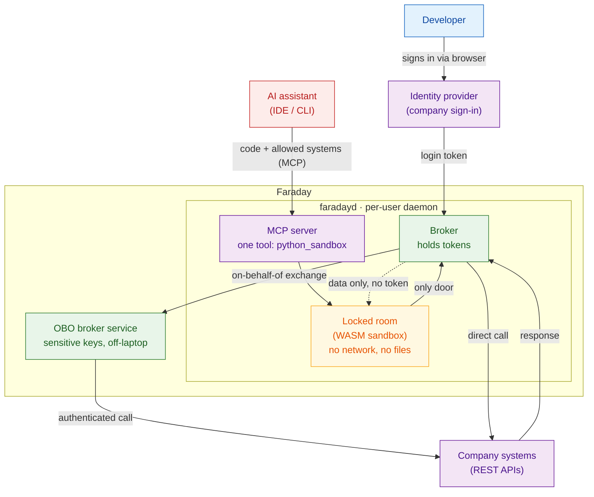

# Faraday

*Faraday is an architecture, and a working implementation of it, for letting AI-authored
code use real systems through a capability broker: the code runs with no credentials and no
network of its own, and every authenticated call is made on its behalf by a broker that holds
the keys. The host daemon, `faradayd`, is built in Rust; the backend OBO broker is specified
here but not yet implemented.*

## Overview

AI assistants are getting good at writing small programs to get a job done. But when
that program needs to reach a real system (your company's ticketing tool, GitHub, an
internal service), it needs permission, and permission usually means a password or a
login token. Handing a login token to code that an AI wrote is risky: the AI could be
tricked, and the code could leak the token by accident.

The core idea is an architectural pattern: **an AI assistant writes and runs small
programs that talk to real systems, but those programs never hold the credentials.** The
keys stay with a separate broker that makes each call on the program's behalf.

It works like this:

- The AI writes a short program (in Python) and says which systems it wants to talk to.
- The program runs in a **locked room**. Inside that room it cannot open the network,
  read your files, or start other programs. There is only one door.
- That one door leads to a trusted helper called the **broker**. The broker is the only
  part that holds your login tokens. When the program wants to call a system, it asks
  the broker, and the broker makes the call for it and hands back only the answer.

So the program can get useful work done, but the login tokens never enter the room.
If the program misbehaves or is tricked, it cannot read or leak the tokens, because they
are not there to be read. It can still reach the systems the broker allows, so what it
can do, and where data can go, is bounded by that allowlist rather than by the program.

Two components implement the pattern:

- **The sandbox daemon (`faradayd`)**: the locked room and the broker, running as a
  **per-user background service** on the developer's machine (a single Rust binary). It is
  **independent of the editor**: any AI assistant (in VS Code, another IDE, or a command-line
  tool) reaches it the same way, through a **single MCP tool** (`python_sandbox`, served
  over stdio via `faradayd mcp-stdio`), so there is **no per-editor plugin to build or
  install**: registering one MCP server is all it takes.
- **The OBO broker service**: a small server that holds the most sensitive keys away
  from the developer's laptop entirely, so they live somewhere safer.

---

## Context



Colours in the diagram: blue is the person, red is the untrusted AI-written code, amber is
the locked room that isolates it, green is where credentials live, and purple is the outside
world.

### Who it's for.
Companies whose developers use AI assistants, where those assistants
increasingly need to *act* in the company's real systems (read a wiki page, file a ticket,
look something up in a code repository) on the developer's behalf.

### What it promises.
The assistant writes a small program that may use a **pre-approved list** of company systems, while the passwords and access keys for those systems are
**never handed to the program or to the AI**.

The broker holds the keys and makes each call
itself, so if the AI is tricked or the program misbehaves, there is no key present for it to
steal or leak.

### What it deliberately does not promise.

It does **not** give the AI free run of
everything the developer can reach, only what an administrator has put on the approved
list, and that boundary is the point, not a limitation. Keeping the keys safe is also not
the same as letting the program do anything it likes: what it can touch, and where data can
go, are bounded by that list. And real company credentials are switched on only after a
dedicated security test of the "locked room" has passed; until then it runs in a safe,
mock-only mode.

### How it's delivered, and how it relates to per-action tools.
Faraday is itself an **MCP
server**, but instead of exposing one ready-made tool per action ("get a ticket", "list
tickets", …), it exposes a **single** tool, `python_sandbox`, that runs AI-authored code. The
familiar per-action style is a good fit for a handful of actions; this code-execution style
targets the harder case: workflows that chain many calls across many systems, where a large
catalogue of per-action tools turns slow, costly, and awkward to govern. The two are
complementary: use per-action tools for simple jobs, and code execution for the involved,
multi-system work.

---

## Get started

Want to see it run on your own machine? The **[sandbox daemon get-started guide](sandbox-daemon/get-started.md)**
takes you from a fresh checkout to a working local demo in a few minutes: it installs
`faradayd` as a background service, wires in a local sign-in (Dex) and a stub API, and walks
you through your first sandboxed `python_sandbox` call end to end. It also includes a context
diagram of the local setup and documents every configuration file and the rationale behind
it. macOS today; Linux and Windows installers are planned.

---

## Why not just use MCP tools?

Short answer: faraday **is** an MCP server. The difference is that it gives the AI *one* tool
instead of a long list of them.

The usual way to connect an AI to a system is to wrap each action in its own MCP tool: "get a
ticket", "list tickets", "add a comment", and so on. That is fine for a handful of actions. It
gets heavy once an agent needs dozens of them across several systems:

- **Every tool costs context.** The AI carries a description of all of them on every request,
  whether it uses them or not — and you pay for that each time.
- **Every step is a round-trip.** The AI calls a tool, reads the result, decides, calls the
  next one. The model is back in the loop at every step.
- **More tools, more upkeep.** Each one is hand-built code you keep working as the system
  behind it changes.

faraday gives the AI a **single** tool, `python_sandbox`, and lets it write a short program
that calls the systems' own REST APIs through the broker. The loops and the back-and-forth
happen inside the program, not by sending the model out and back each time. You decide what it
can reach with **one allowlist**, instead of building a tool per action.

It is not always the better trade. For a couple of simple actions, a per-action tool is less
work. The full, point-by-point comparison is right below.

## How this compares to per-action MCP tools

Both styles reach the AI the same way, over **MCP**. The common one gives the AI **one tool
per action** ("get a ticket", "list tickets", "add a comment") and the AI calls them one
at a time.

Faraday's MCP server takes a different route: it exposes a **single** tool
(`python_sandbox`), and the AI writes a small program that calls the systems' own REST APIs
through the broker. You don't wrap each system in a custom tool; you let the program talk to
it.

The two styles trade off against each other in six ways. Each point below states where code
execution differs, and what it costs or where per-action tools still do the job better.

### 1. Where the non-determinism goes

With separate tools, the AI drives every step itself. Get a ticket, look at the answer,
decide what to do, call the next tool, look again. Each "look and decide" moment is the AI
choosing, and those choices can vary between runs.

With code execution, the AI writes the whole sequence **as one program, up front**: the loops,
the branches, the joining of results. Once written, the program's control flow runs the
same way every time, so the AI's variability happens once at authoring time rather than at
every step.

This does not remove non-determinism, it relocates it: writing the program is itself a
model decision that can vary run to run, and the data the remote systems return can vary
regardless. The benefit is real for tasks whose steps can be planned in advance; tasks
that must adapt to what each step returns still need the model back in the loop.

### 2. Context and cost

Every tool you give an AI has to be described to it: its name, what it does, every input
it takes. Fifty tools means fifty descriptions carried in the model's context **before it
has done anything**, and you pay for that context on every request. The one-tool-at-a-time
style also loops the model back in after every step (call a tool, return the result, wait
for the next decision), so each step is another paid round-trip and the intermediate
results pile up in context too.

This approach avoids both: the AI writes one program, that program does the back-and-forth in
code, and the intermediate results never return to the model's context. Fewer round-trips,
less to carry.

The cost does not vanish entirely, it shifts. To write a program against a system's REST
API, the model needs to know that API's shape (from documentation or an OpenAPI spec), so
some of what per-action tools spend on tool schemas is instead spent on API knowledge. The net saving
depends on how many calls a task makes and how well the model already knows the APIs.

### 3. How systems get connected

Most modern systems expose a **REST API over HTTPS**. The per-action approach asks you to wrap
a system in a hand-built tool first, and to build and maintain one for every action of every
system. A program in this model calls the REST API directly through the broker, so connecting a
system is mostly a matter of saying "this system is allowed, here are the addresses it may
call"; no new tool to write or ship.

The limit: not everything speaks clean REST. Systems that expose GraphQL, gRPC, or
proprietary protocols still need adapting, and a per-action tool can add value a raw REST call
does not: normalising inconsistent APIs, paginating, or attaching semantic descriptions
that help the model use the system correctly.

### 4. Gateways and infrastructure

When organisations run many per-action MCP servers at scale they often add an **MCP Gateway**,
a new component in front of those servers to control access and apply policy. Because every call in this
model is a normal REST call over HTTPS, those calls can instead go through a **standard API
gateway**: the same well-understood product companies have run for years, with existing
skills and policies.

This reuses gateways rather than removing new infrastructure altogether. This approach brings its
own moving parts (the broker, the sandbox runtime, and a signed per-user host-service
daemon), so the trade is one new kind of gateway for a different set of new
components, not zero new infrastructure.

### 5. Governing what an agent can reach

With per-action tools, each agent should see only the tools it needs, so someone decides which
tools go to which agent and keeps that list trimmed, often inside an MCP Gateway. This approach governs
access in one place instead: an allowlist of systems and addresses, applied the same way no
matter how many agents there are.

This centralises the decision but does not remove it, and it changes its grain. A host- or
address-level allowlist is coarser than per-tool permissions: unless the broker also
enforces which methods and paths are allowed, permitting a host permits every endpoint on
it, including destructive ones. In both models, an allowlist left too wide is a security
risk; this approach moves the burden rather than eliminating it.

### 6. Standards and stability

The systems your code calls speak **REST over HTTPS**, settled for years, not going
anywhere, with a deep pool of existing tooling and know-how. A large catalogue of per-action
tools, by contrast, is a bespoke surface: each tool's schema can need rework as the system it
wraps changes, and the more tools you maintain the more there is to keep current.

The other side: both styles still ride **MCP** to reach the AI, and MCP is new and still
evolving, but faraday's exposure to that churn is a **single, simple tool** (`python_sandbox`),
not a large bespoke catalogue. Beyond MCP, this approach depends on its own contracts (the
broker protocol, the sandbox's single-door interface, the program conventions), which are
stable but bespoke. The trade is a small, fixed tool surface plus a few internal contracts,
against a growing set of per-action tool definitions.

---

## A note on safety

The foundation is the **locked room**. The program runs inside a WebAssembly sandbox that,
by its nature, has no way to open a network connection, read the disk, or start another
program. It isn't "blocked after the fact": those abilities are not granted to the room in
the first place. The only path out is the single door to the broker, and the broker never
lets a login token through it.

What this guarantees is precise: the **login tokens never enter the sandbox**, so a
misbehaving or prompt-injected program cannot read or leak them. It does **not** by itself
stop data from leaving: the single door is still a channel. A program can read from one
allowed system and send data to another, so what can leave is bounded by the broker's
allowlist (and any method- and path-level policy the broker enforces), not by the sandbox
alone. The locked room protects the keys; controlling where data can flow is the broker's
job.

---

## Project structure

This repository holds the **design docs** for Faraday and the **Rust implementation** of its
host daemon. The top level keeps one directory per implemented product, each self-contained
with its own toolchain; the repository root holds only documentation and repo metadata (no
language manifest like `go.mod` or `Cargo.toml` lives at the root).

```
/
├── README.md  LICENSE  faraday.svg  .gitignore
├── .github/workflows/                        # CI (sandbox-daemon)
├── docs/
│   ├── concept/                              # background notes
│   ├── design/{sandbox-daemon,obo-broker}/   # High-Level Designs (one folder per topic)
│   ├── security/threat-model.md              # cross-cutting STRIDE threat model
│   └── spec/{sandbox-daemon,obo-broker}/     # Low-Level Design specs (phase-1…6)
│
└── sandbox-daemon/                           # the faradayd host daemon, Rust (one binary)
    ├── Cargo.toml  Cargo.lock  deny.toml  rust-toolchain.toml
    ├── CHECKSUMS.txt                         # digest of the bundled guest artefact
    ├── src/                                  # daemon modules: endpoint, clientauth, broker, obo, runtime, mcp, …
    ├── tests/                                # integration tests
    ├── guest/                                # the locked room: RustPython compiled to wasm32 (Rust) + the built .wasm
    ├── examples/demo/                        # local end-to-end demo (Dex + dummy API)
    └── packaging/macos/                      # per-user service installer (launchd)
```

The backend **OBO broker** is currently design-only: its HLD and specs live under `docs/`, its
tech stack is Go, but no code tree exists in this repository yet.

The `sandbox-daemon/` product is built into a **signed per-user host-service installer**
bundling the native daemon binary plus the single, digest-verified `guest` WebAssembly
artefact (ADR-022 / ADR-023 / ADR-018). The whole daemon is **Rust**: one binary, no
Node/TypeScript runtime (ADR-026). Only the **macOS** installer (`packaging/macos/`, launchd)
is present today; the systemd-user and Windows-service variants are planned.

### Conventions

- **One subtree per product, each self-contained.** `sandbox-daemon/` owns the Rust toolchain
  (`cargo`, `wasm32` target, `cargo audit`/`deny`). When the `obo-broker/` code lands it will
  own the Go toolchain in its own subtree; no language manifest lives at the repository root.
- **Spec paths are component-relative.** A `**File:**` path in a spec (e.g. `src/config.rs`,
  `cmd/obo-broker/main.go`) is resolved against its component root (`sandbox-daemon/` or
  `obo-broker/`), not the repository root. Code generation writes files under the owning
  component directory.
- **Build output is never committed.** `target/`, `dist/`, `out/`, and packaged installers
  are git-ignored.

## Where to read more

### Start here

- [Get started: run the local demo](sandbox-daemon/get-started.md) — fresh checkout to a working `python_sandbox` call
- [Configure faradayd](configure.md) — every setting, all four capability auth modes, and worked examples for pointing faraday at your own systems
- [The locked room and broker (sandbox daemon): design index](docs/design/sandbox-daemon/README.md)
- [The key-holding server (OBO broker): design index](docs/design/obo-broker/README.md)
- [Threat model](docs/security/threat-model.md): what we protect against and why
