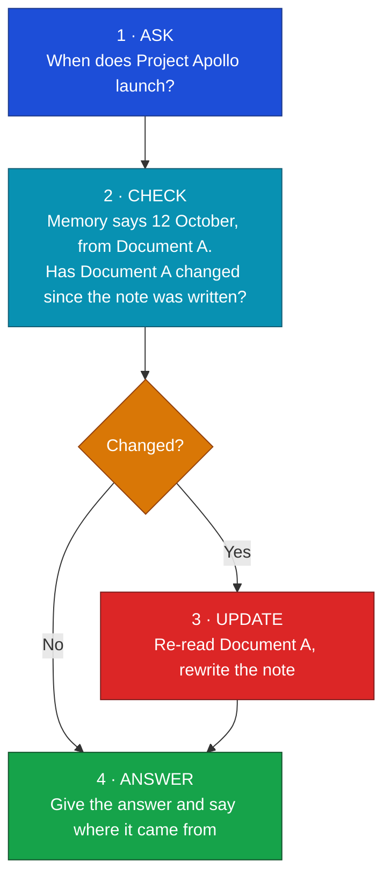

# A search that keeps its own notes up to date

How to move from "dumb search that returns links" to a shared memory the whole
company can trust.

---

## 1. Why normal company search disappoints

Most company AI search works the same way: it copies every file from every system
— the wiki, the code repository, the shared drives — into one big database, chops
each file into small pieces, and indexes them so it can find text by meaning.

That works for simple lookups. In a real company it runs into three problems.

1. **Old and new get mixed together.** If five outdated versions of a plan are all
   in the database, the answer pulls bits from all of them and blends last year's
   numbers with this year's.
2. **It falls behind.** Files change all day. The big database is only rebuilt on a
   schedule, so it's often hours or days out of date. A document edited at 9:00 AM
   might not be picked up until the next rebuild.
3. **It's hard to keep private.** Once everything sits in one shared database, it
   takes real effort to stop an intern's search from surfacing the salary
   spreadsheet.

None of this makes the copy-everything approach useless. It has a real strength: once
the work is done up front, each answer is a fast lookup. The approach in this document
trades some of that speed away — it does more work at the moment you ask — in return
for staying current and keeping things private. So this isn't "old way bad, new way
good". It's a choice about when you do the work: ahead of time, or when the question
is asked. Many real systems land in the middle and do a bit of both. This document
describes the ask-first end of that range.

---

## 2. The idea: a shared memory built from real questions

Instead of copying everything up front, the system learns as people ask.

The first time someone asks about Project Apollo, the agent reads the relevant
document and writes a short summary of the key facts: *"Apollo launches 12 October,
lead engineer Sarah, owned by Team Alpha."* It saves that summary, along with a note
of which document the facts came from.

That growing set of summaries is the **shared memory**. The next time anyone asks
about Apollo, the agent starts from the summary instead of re-reading the whole
document.

```
[ User asks ] ──> [ Agent ] ──> [ Shared memory ]
                                      │
                                 (quick check)
                                      ▼
                              [ Original document ]
```

---

## 3. How it stays current

Every question runs the same short loop:



The cheap part is the check. Working out whether a document changed does not mean
re-reading it. Every file carries a last-edited date, like the "modified" date on a
file on your computer. The agent just compares that date against the one stored with
its note. If they match, the note is still good and the answer is instant. Only when
the date has moved does the agent spend the effort to re-read and rewrite.

So you only pay to read a document when it has actually changed, and the system gets
faster the more it is used.

---

## 4. Keeping data private

The agents do not get a master key to the company's files. When an agent acts for a
user, it uses that user's own permissions and nothing more.

- An executive asks about a project, and the agent can reach the files the executive
  is allowed to see.
- An intern asks about the same project, and the source system returns "access
  denied". The agent treats that information as if it isn't there.

Access is decided by the systems that already hold the files. The AI cannot get
around the permissions those systems enforce.

One thing to watch: the memory is shared, but people's permissions are not. A fact
one person was allowed to learn must not leak to someone who wasn't. The safe
approach is a quick per-user permission check — as that user — before trusting a
saved note.

---

## 5. Why it's worth doing

- **Lower cost.** The system reads a document only when it has changed. The rest of
  the time it answers from short notes and quick date checks, which are cheap.
- **Current answers.** Because it checks freshness before answering, people don't get
  answers based on a stale version.
- **It organises itself.** The memory grows around what people actually ask. A
  document nobody asks about is never summarised, so no effort is wasted on it.
- **Answers are reused.** When one agent works out a hard answer, it's saved. The next
  person who asks gets it straight away.

Be honest about the cost, though. Answering this way does more work at the moment
someone asks: checking dates across several systems, and sometimes reading and
summarising a document on the spot. So a single answer can be a little slower, or use
more computing power, than looking it up in a database that was built earlier. What you
save is the steady cost of rebuilding that database over and over, and the cost of
being wrong because it had fallen out of date. Whether that's a good trade depends on
how often your documents change and how fresh your answers need to be.

---

## 6. Topics it hasn't seen yet

The loop above works for things the system has already learned. When someone asks
about a brand-new project, the agent doesn't guess. It switches to a slower,
first-time path:

1. **Search.** It uses the normal search in the source systems (the wiki search, the
   code search) to find relevant files, the same way a person would.
2. **Read and summarise.** It reads the top results and writes a new note.
3. **Save it.** It stores that note along with the last-edited dates of the files it
   read.
4. **Answer.**

After that, the topic is part of the shared memory. The slower first-time path runs
once per topic; every later question uses the fast check-and-update loop.

---

## 7. Linking facts together

Folders and files are flat. To answer "Who is the lead engineer on Project Apollo,
and what else are they working on?" a person has to open the project document, find a
name, then open the org chart and trace the lines.

The shared memory stores facts as links between things, not as blocks of text:

- Project Apollo *is owned by* Team Alpha
- Sarah *is lead engineer of* Team Alpha
- Sarah *wrote* the Apollo architecture document

For a question that spans several documents, the agent follows these links instead of
re-reading everything.

---

## 8. When documents disagree

In a large company, documents contradict each other. An old slide deck says a project
launches in May; a newer document says August.

Because each fact is stored with its source and last-edited date, the agent can spot
the disagreement and apply plain rules:

- **Prefer the newer document.** Trust the one edited most recently.
- **Prefer the official source.** Trust an approved space over a drafts folder.
- **Show both, with sources.** The agent says where the answer came from: *"Launch is
  in August (Word document, edited yesterday), though an older slide deck from January
  said May."*

---

## 9. What it looks like over time

The approach needs no upfront indexing project.

- **Day 1.** The memory is empty. Agents spend more time on the first-time path,
  reading documents and writing the first notes. It feels like a normal, slightly
  slower assistant.
- **Day 30.** The common topics — major projects, HR policies, key technical
  designs — are mapped. Most questions are answered straight from memory.
- **Day 100.** The memory covers how the company actually works: which teams own
  which projects, who the experts are, how decisions changed over time. It keeps
  itself current in the background as documents change.

---

## 10. The short version

- Don't copy everything up front. Learn as people ask, and remember in plain summaries.
- Check whether a document changed before trusting an old note. Re-read only when it
  did.
- Let the existing systems enforce who can see what.
- Always say where an answer came from.

The result is cheaper to run than a full index, stays current, and respects the
permissions the company already has.
