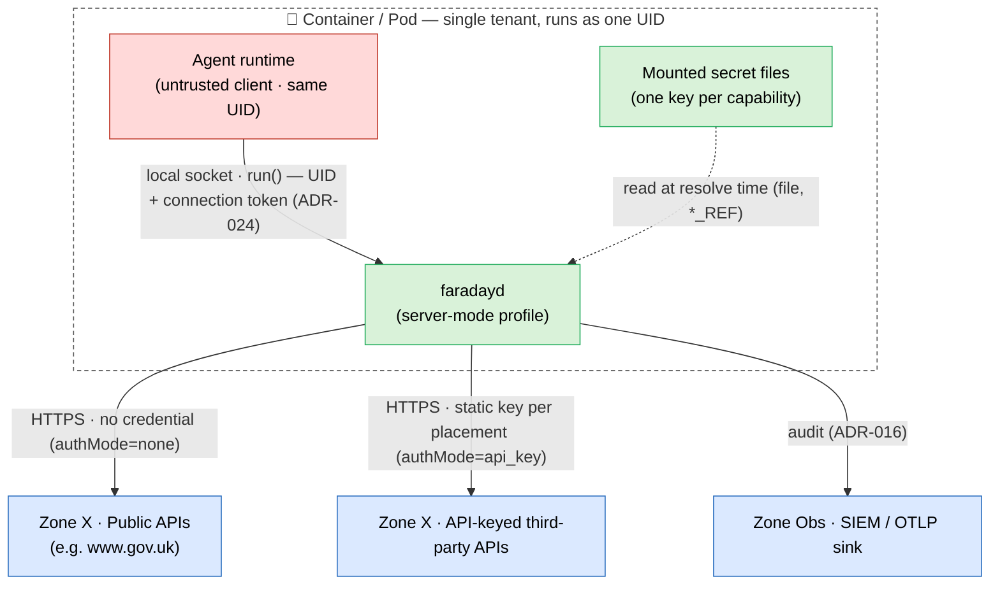

# 01 — System Context

> **Revision:** 0.3.0

In the server-mode profile, the human user, the system browser, the OIDC IdP, and the `obo-broker` are **absent** from the principal flow (they remain available to the desktop profile and to OIDC-backed capabilities, which are not the subject of this design). What remains is: an agent runtime, the `faradayd` daemon it shares a container with, and the external APIs the broker calls — public or API-keyed.

## System context diagram

## External actors and neighbouring systems

- **Agent runtime** — the headless process that authors and submits Python to run. **Interaction:** local socket (`0600` UDS) → `run(code, requestedCapabilities)`; authenticated by peer-UID + connection token (sandbox-daemon ADR-024). Shares the container and UID with the daemon, so it crosses **TB1** exactly as a desktop client does — no new boundary.
- **Public APIs** — allowlisted public endpoints requiring no credential. **Interaction:** HTTPS, no `Authorization`, direction daemon → API (`authMode: none`).
- **API-keyed third-party APIs** — allowlisted services authenticated by a static key. **Interaction:** HTTPS, key attached per the capability's configured placement, direction daemon → API (`authMode: api_key`).
- **SIEM / OTLP sink** — the authoritative audit record. **Interaction:** OTLP export; mandatory in real-credential mode (sandbox-daemon ADR-016), unchanged by this profile.

## Removed from the principal flow (vs the desktop profile)

- **Developer (human) + consent/sign-in screen** — no human is present; the interactive sign-in surface (sandbox-daemon ADR-025 / ADR-029) is not exercised by `api_key`/`none` capabilities.
- **OIDC IdP** — not contacted for `api_key`/`none` capabilities.
- **`obo-broker`** — not used; there is no token exchange in this profile (ADR-035). It remains the mechanism for `Exchange` capabilities, which this profile does not introduce.
