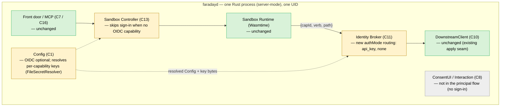

# 02 — System Architecture

> **Revision:** 0.3.0

The server-mode profile reuses the existing `faradayd` components unchanged in name and responsibility (see [sandbox-daemon 02-architecture](../sandbox-daemon/02-architecture.md)). It changes the **behaviour of three of them** and **removes one from the principal flow**. No new component is introduced.

## Component diagram

## Component responsibilities (delta only)

- **Identity Broker (C11)** — *changed.* Adds two arms to the per-capability auth-mode routing it already performs (`Exchange` → `obo.exchange`, `Passthrough` → apply held `access_token`): `api_key` → apply the capability's resolved static key per its configured placement; `none` → apply no credential. The existing guarantee is preserved verbatim — the key is applied to the outbound request and **never serialised into the returned envelope**. Owns: the in-memory key material for the run's `api_key` capabilities. Depends on: Config (key bytes), DownstreamClient (egress).
- **DownstreamClient (C10)** — *unchanged.* C11 builds the key placement (a request header with a configured name and scheme, or a query parameter) and applies it through C10's existing `apply` closure / `Params`→query seam; C10's code is not modified. HTTPS-only egress is unchanged (the loopback-plaintext exception, sandbox-daemon ADR-032, is unaffected). Depends on: nothing new.
- **Sandbox Controller (C13)** — *changed.* When the resolved capabilities for a run include **no** OIDC-backed capability (`Exchange` / `Passthrough`), the Controller raises **no** `InteractionRequired::SignIn` and collects **no** audiences — the run proceeds without a human. When OIDC-backed capabilities are present, behaviour is unchanged. Depends on: Config (to know the deployment's OIDC posture).
- **Config (C1)** — *changed.* The OIDC configuration group (issuer + client id) becomes **optional**: required only when the manifest contains an OIDC-backed capability; absent otherwise, the daemon starts ready (ADR-038). Adds resolution of per-capability key references via the existing `SecretResolver` (`FileSecretResolver`). Adds a load-time **read-only-default** validation: a capability without the write opt-in flag may declare only `GET`, else load fails closed (ADR-039). The ADR-016 rule is unchanged — real credentials still require the OTLP sink.
- **ConsentUI / Interaction (C8)** — *not in the principal flow.* `api_key` and `none` capabilities trigger no sign-in, consent render, or step-up. The component is retained for OIDC-backed capabilities; in a pure `api_key`/`none` deployment it is never invoked. Consent for write capabilities is satisfied by the admin-signed policy as a pre-grant, not by an interactive render — per-session consent is a no-op in headless mode (ADR-039).

## Unchanged

- **Front door / MCP (C7 / C16)** — the agent connects, and the `mcp-stdio` sub-mode behaves, exactly as on the desktop profile (sandbox-daemon ADR-028).
- **Sandbox Runtime (Wasmtime + RustPython)** — the seal, the single broker host import, and the hardened WASI subset are unchanged (sandbox-daemon ADR-013 / ADR-019). The guest still never touches a credential.
- **Authorisation** — the policy allowlist (host / path / method), path canonicalisation, and per-run/session budgets apply to `api_key` and `none` capabilities identically.
