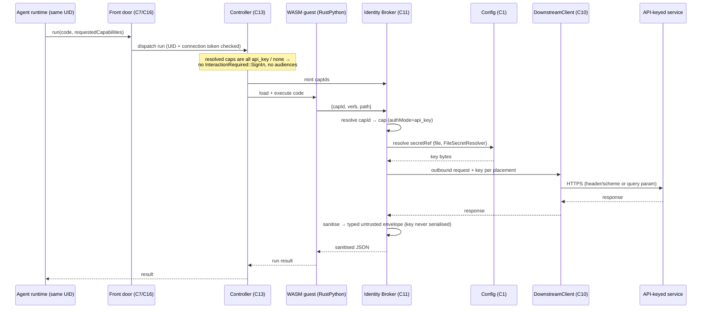
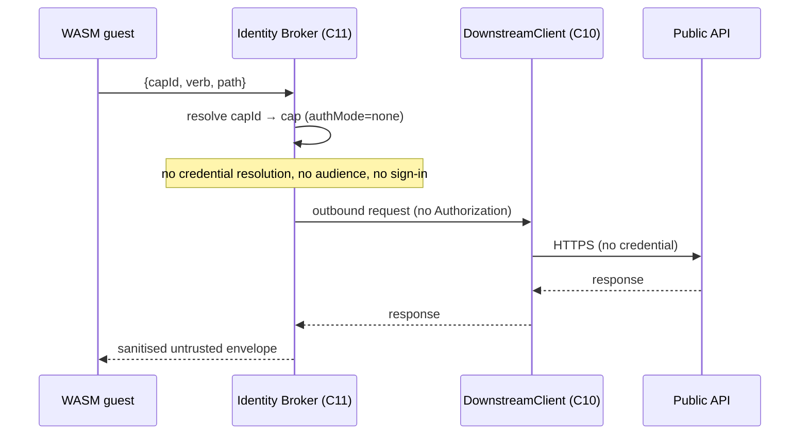
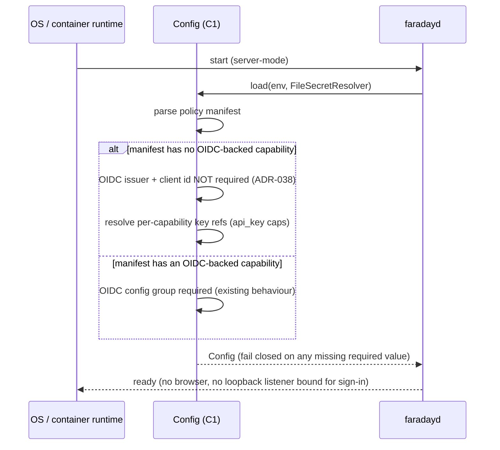

# 03 — Principal Sequences

> **Revision:** 0.3.0

## Sequence: server-mode `api_key` call (golden path)

- **Trigger:** the agent submits `run(...)` whose requested capabilities resolve only to `api_key` / `none` modes.
- **Result:** the outbound call is made with the static key attached per the capability's placement; the guest receives only sanitised JSON; no human interaction occurs.
- **Error posture:** unknown capability → fail closed (`CAP_UNKNOWN`, existing); off-allowlist host/path/method → fail closed (existing); unresolvable `secretRef` → fail closed at resolve time (existing `CFG_SECRET_UNRESOLVED` shape; exact code in `/spec`); downstream unavailable → typed error to guest (existing). The key is never placed in an error, log line, or returned envelope.

## Sequence: server-mode `none` (public) call

- **Trigger:** the guest calls a `none` capability (e.g. a public dataset).
- **Result:** the call is made with no credential; the response is sanitised and returned. The allowlist (host/path/method), budgets, and audit still apply — `none` is *not* "any call".
- **Error posture:** identical to the golden path, minus credential resolution.

## Sequence: startup with no OIDC-backed capability

- **Trigger:** the container starts the daemon.
- **Result:** the daemon is ready to serve `api_key`/`none` runs with no OIDC configured. If real `api_key` credentials are in use, the ADR-016 OTLP-sink requirement is still enforced fail-closed at startup.
- **Error posture:** a missing required value (policy path, an `api_key` capability's `secretRef`, or the OTLP sink in real-credential mode) fails startup closed — the daemon does not start in a degraded-but-serving state.
