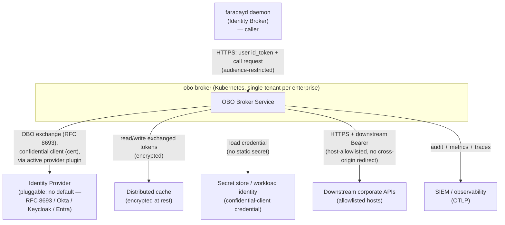

# 01 — System Context

## System context diagram

## External actors and neighbouring systems

- **`faradayd` daemon (Identity Broker)** — the only caller. **Interaction:** HTTPS request carrying the user's audience-restricted `id_token` and the capability call (`{capabilityId, verb, path, params?, body?}`); receives sanitized JSON. No downstream token is ever returned.
- **Identity Provider (pluggable; selected per deployment, no default — ADR-017)** — performs the token exchange and issues downstream credentials. Concrete providers include a generic RFC 8693 authorization server, Okta, Keycloak, and Microsoft Entra. **Interaction:** outbound HTTPS to the provider's RFC 8693 token endpoint, authenticated as a confidential client using a certificate. The provider-specific details are encapsulated in the active Provider Plugin (ADR-009).
- **Distributed cache (encrypted)** — holds exchanged downstream credentials keyed by `(user, audience, scopes, providerId)`. **Interaction:** server-to-server, in-cluster, TLS; values encrypted at rest with a service-held key.
- **Secret store / workload identity** — supplies the confidential-client credential without a static secret on disk. **Interaction:** pod federated identity → credential fetch at startup/rotation.
- **Downstream corporate APIs (allowlisted hosts)** — the actual targets of the proxied call. **Interaction:** HTTPS with the OBO-minted Bearer; host/path/method allowlisted; no cross-origin redirect following.
- **SIEM / observability** — receives audit, metrics, and traces. **Interaction:** OTLP export; correlation by the daemon-supplied `runId`.

## Trust boundaries

1. **Extension ↔ service** — the service trusts only a validated, audience-restricted user `id_token`; the daemon is otherwise unauthenticated (public client). This is the boundary where the workstation ends and the server begins.
2. **Service ↔ identity provider** — the confidential-client credential lives only on the service side of this boundary.
3. **Service ↔ downstream APIs** — privileged downstream tokens exist only between these two; they never cross back to the daemon.
