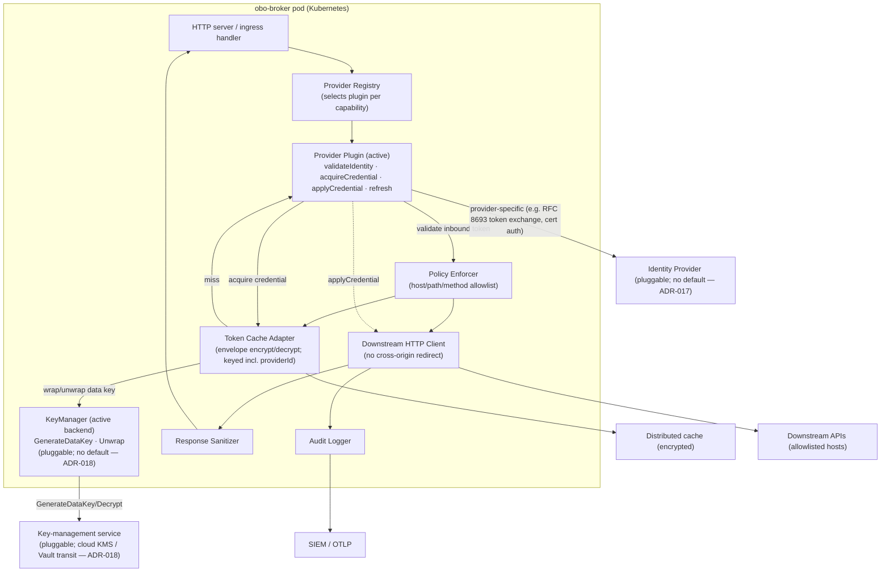

# 02 — System Architecture

## System architecture diagram

## Component responsibilities

- **HTTP server / ingress handler** — terminates TLS (or sits behind cluster ingress), accepts the exchange-and-call request, applies global rate limiting, and returns the sanitized response or a typed error. **Owns:** the request lifecycle. **Depends on:** all components below.

- **Provider Registry** — selects the **Provider Plugin** for the requested capability (by its `provider` field) and exposes the active plugin to the request path. **Owns:** plugin selection and lifecycle. **Depends on:** the set of in-tree, compiled-in plugins and the configured provider per capability. Plugins are first-party and security-reviewed — never dynamically loaded (ADR-009).

- **Provider Plugin (active)** — the swappable, IdP-specific unit implementing one contract: `validateIdentity` (validate the inbound user token — signature against the provider's JWKS, issuer, expiry, and `audience` = this service), `acquireDownstreamCredential` (obtain the downstream credential, e.g. Okta RFC 8693 token exchange, using the confidential-client credential and the cache), `applyCredential` (attach it to the outbound request as a Bearer, custom headers, mTLS, or API key), and `refresh`. **Owns:** all provider-specific identity validation and credential acquisition. **Depends on:** the Identity Provider and the secret store / workload identity. Reference baseline: a generic RFC 8693 token-exchange plugin; peer first-class plugins include Okta, Keycloak, and Microsoft Entra (ADR-017). **Guardrails (ADR-012):** the core re-validates the returned `Principal`'s `iss`/`aud` independently, and the plugin acquires credentials through a constrained path rather than holding raw confidential-client material — required wherever the provider exposes a constrained-acquisition API; a plugin whose provider offers no such API documents the exception and undergoes dedicated security review (settled per-plugin in `/spec`).

- **Policy Enforcer** — resolves the requested `capabilityId` against a derived copy of the daemon's capability manifest; canonicalises the path (reject `..`), checks host and method; enforces per-user/per-agent and global rate budgets. **Owns:** authorisation. **Depends on:** the configured policy. Provider-agnostic.

- **Token Cache Adapter** — looks up and stores exchanged tokens keyed by `(user, audience, scopes, providerId)`, encrypting values at rest (AES-256-GCM under a per-entry data key obtained from the **KeyManager**; envelope encryption — ADR-011); enforces TTL ≤ the token's own expiry. **Owns:** the token cache contract. **Depends on:** the distributed cache and the **KeyManager** (ADR-018).

- **KeyManager (active backend)** — the pluggable key-management SPI (ADR-018): `GenerateDataKey` mints a per-entry data key (returning the plaintext DEK to seal with and the wrapped DEK to persist), and `Unwrap` recovers the plaintext DEK on read. The active backend is selected at startup by `OBO_KMS_PROVIDER` (one per single-tenant instance, no default); in-tree backends cover cloud KMS (AWS/GCP/Azure) and a Vault transit engine. **Owns:** all key-management-service interaction; the cache never touches a concrete KMS. **Depends on:** the configured key-management service. Backends are first-party, in-tree, compiled-in, and security-reviewed — never dynamically loaded (ADR-009/ADR-012 trust stance).

- **Downstream HTTP Client** — issues the authenticated HTTPS call to the allowlisted host with the OBO Bearer; does not auto-follow cross-origin redirects and never forwards `Authorization` across hosts. **Owns:** the egress call. **Depends on:** the downstream APIs.

- **Response Sanitizer** — strips headers to a safe set, applies a size cap, checks content type, and marks the body as untrusted content for the caller (carrying the parent's T6 stance). **Owns:** outbound response hygiene.

- **Audit Logger** — writes one append-only entry per exchange + call (sizes, keyed-HMAC user identifier, never tokens or bodies) and exports via OTLP. **Owns:** the audit trail. **Depends on:** the SIEM/observability sink.

The service is otherwise **stateless** — all shared state lives in the distributed cache — so it scales horizontally behind a standard Kubernetes Deployment + Service.
