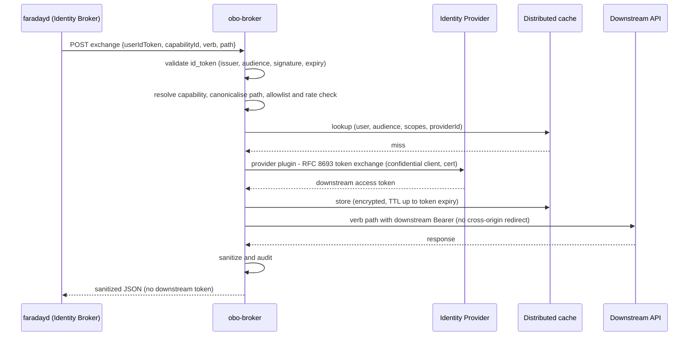
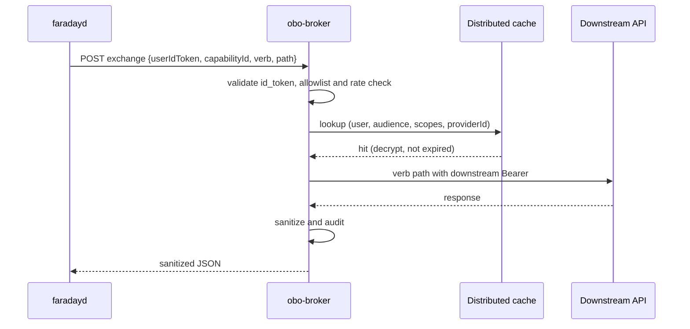
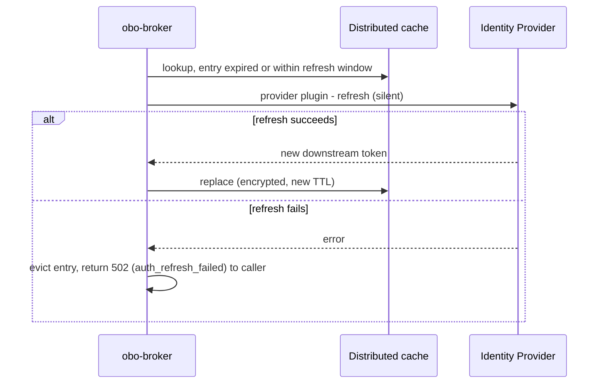

# 03 — Principal Sequences

## Sequence: Exchange and call — cache miss (golden path)

- **Trigger:** the daemon's Identity Broker proxies a sandbox call to a token-exchange capability (the provider is selected by the Provider Registry per the capability's `provider` field — ADR-017).
- **Result:** the daemon receives sanitized downstream JSON; the downstream token stays server-side.
- **Error posture:** invalid/expired/wrong-audience `id_token` → `401`; capability/host/path/method not allowed → `403`; rate budget exceeded → `429`; token-exchange failure → `502` with no token surfaced; IdP/cache unreachable → `503`; downstream timeout → `504`.

## Sequence: Exchange and call — cache hit

- **Trigger:** as above, when a non-expired token is cached.
- **Result:** the IdP round-trip is skipped; lower latency.
- **Error posture:** a decrypt failure or near-expiry token falls through to the cache-miss exchange path.

## Sequence: Silent refresh on expiry

- **Trigger:** a cached token is expired or inside its refresh window at use time.
- **Result:** transparent re-exchange; the caller is unaware on success.
- **Error posture:** on refresh failure the entry is evicted and the caller receives an auth-failure shape; no token is surfaced.
