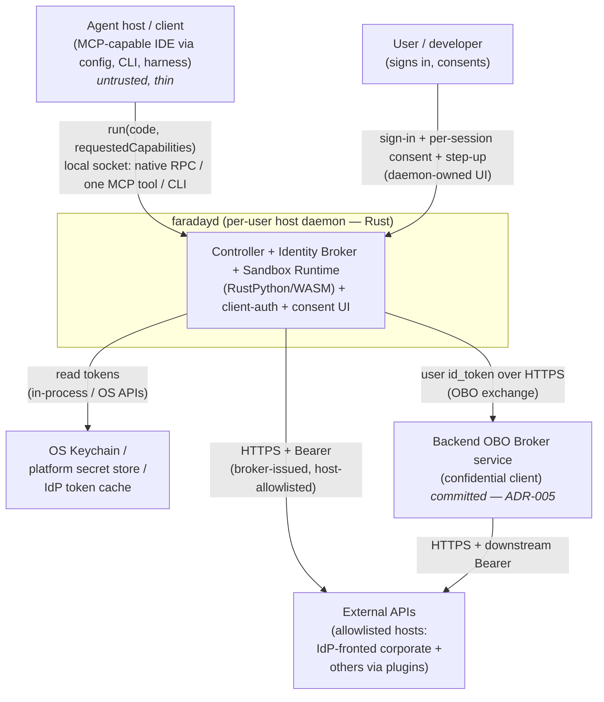

# 01 — System Context

## System context diagram

## External actors and neighbouring systems

- **Agent host / client** — untrusted producer of the Python to execute and the requested capabilities; a **thin client** holding no tokens and rendering no UI. **Interaction:** a single `run(code, requestedCapabilities)` entry over the daemon's local socket — the faraday-native RPC, the single MCP tool, or the CLI; the client authenticates with the connection token + peer-UID (ADR-024), not as a trusted principal.
- **User / developer** — authenticates to the organisation's OIDC identity provider (e.g. Okta, Keycloak, Entra) and grants per-session consent. **Interaction:** OIDC sign-in, consent, and step-up rendered by the **daemon-owned UI** (ADR-025); decisions cached in-memory per `(client, workspace)` session.
- **OS Keychain / platform secret store / IdP token cache** — where the user's tokens physically reside. **Interaction:** read-only by the daemon via the OS keychain and the OIDC sign-in session; never copied to the sandbox.
- **External APIs (allowlisted hosts)** — IdP-fronted corporate endpoints (and other allowlisted hosts via pluggable providers) the broker is permitted to call. **Interaction:** HTTPS with a broker-held Bearer token, host-allowlisted, no cross-origin redirect following.
- **Backend `obo-broker` service** *(committed — OQ-6 resolved; ADR-005)* — a server-side confidential client that performs provider-pluggable token exchange (no default IdP — see `../obo-broker/` ADR-017) for corporate APIs, because a distributed desktop daemon cannot safely hold a confidential client credential. **Interaction:** the daemon sends the user's `id_token` over HTTPS; the backend holds downstream tokens and never returns them to the workstation. Its HLD is at [`../obo-broker/`](../obo-broker/README.md).

## Trust boundaries

1. **Sandbox ↔ daemon** — the primary boundary, a **WebAssembly capability boundary** rather than an OS process boundary. The WASM guest is untrusted and has no ambient authority; the broker holds all secrets. Crossed only by the single broker host import (carrying a `capId`, verb, and path) and the sanitized response returned from it.
2. **Client ↔ daemon** *(new in the daemon model)* — a local socket gated by per-user ACL + peer-UID + a connection token (ADR-024). The client is untrusted beyond "runs as this user"; only `{capId, verb, path}` and sanitised JSON cross it, never tokens.
3. **Daemon ↔ external APIs** — the broker is the only component that touches the wire to an API with credentials.
4. **Workstation ↔ backend OBO service** — privileged downstream tokens live beyond this boundary, never on the user's machine.
