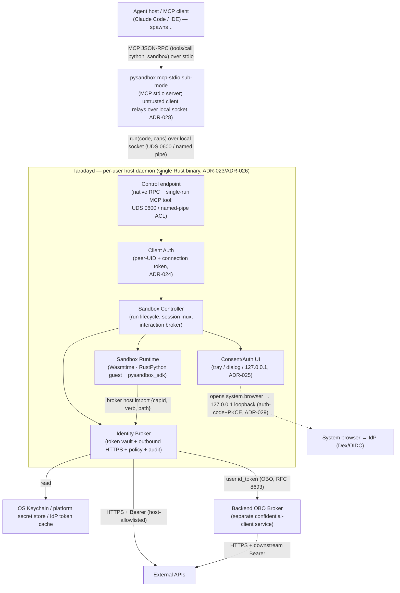

# 02 — System Architecture

## System architecture diagram

## Component responsibilities

All daemon components are **Rust**, in one binary (ADR-026); the Runtime may optionally run as a child process for memory isolation. The whole daemon runs as a **per-user host service** (ADR-023).

- **Control endpoint** (Rust) — the daemon's local socket: a `0600` **Unix domain socket** with `SO_PEERCRED`/`getpeereid` peer-UID on macOS/Linux, and a **named pipe** with a per-user-SID DACL and a `GetNamedPipeClientProcessId`→token-SID peer check on Windows (**never network** — ADR-024/ADR-030). Accepts the single `run(code, requestedCapabilities[, dryRun])` entry over the **faraday-native RPC**; the **MCP front door is the separate `mcp-stdio` sub-mode** (below), which connects here as an ordinary client (ADR-028). Streams results back. **Owns:** the wire protocol + the per-platform local transport. **Depends on:** Client Auth, Sandbox Controller.

- **MCP stdio front door** (`faradayd mcp-stdio` sub-mode, Rust) — a thin **MCP JSON-RPC server over stdin/stdout** that an MCP client (Claude Code / IDE) launches per session (ADR-028). Exposes one tool, **`python_sandbox`** (`{code, requestedCapabilities[, dryRun]}`), and translates `tools/call` into the daemon's control-socket `run` request, carrying the connection token it reads from the user's `0600` file. It is on the **untrusted client side** of the ADR-024 boundary: it holds no tokens, sees only sanitised JSON back, and is the same binary as the daemon (version-locked, ADR-026). **Owns:** the MCP-protocol translation. **Depends on:** the Control endpoint (as a client); the connection-token file.

- **Client Auth** (Rust) — on every connection, verifies the peer UID equals the daemon's and that the client presents the per-launch **connection token**; optionally raises a first-connect consent for a new client identity (ADR-024). **Owns:** the client↔daemon trust boundary. **Depends on:** OS peer-credential APIs.

- **Sandbox Controller** (Rust) — receives execution requests; asks the Identity Broker to mint a **capability bundle** (`{api_name → capId}`); launches the **Sandbox Runtime** with the bundle; multiplexes **sessions** keyed by `(client, workspace)`; routes `interaction_required` to the **Consent/Auth UI**; streams stdout/stderr back after a redaction filter. **Owns:** the run lifecycle and session state. **Depends on:** Identity Broker, Sandbox Runtime, Consent/Auth UI.

- **Consent/Auth UI** (Rust) — renders OIDC sign-in, per-session consent, and step-up when the Controller raises an `interaction_required` challenge (ADR-025). Sign-in is concretely the **browser authorization-code + PKCE flow on a transient `127.0.0.1:<ephemeral>` loopback redirect** (ADR-029): it opens the system browser to the IdP, catches the redirect locally, exchanges the code, and captures the `id_token` **in the daemon only**; step-up reuses the flow with the challenged `acr`. Targets generic OIDC discovery (Dex is one instance). MCP elicitation / CLI prompts remain optional secondary renderers. **Owns:** the human-interaction surface, so no IDE plugin is required. **Depends on:** the system browser + a loopback port; the IdP's OIDC endpoints.

- **Identity Broker** (Rust, in-daemon module; optionally a child process — ADR-010) — single source of truth for credentials. Loads tokens lazily (OIDC sign-in for the user identity; the OS keychain for service tokens; corporate-API access via the backend `obo-broker` service's provider plugins). Maintains the **capability table** (`capId → {provider, scopes, expiresAt, allowedHosts, allowedMethods}`); mints opaque 128-bit capability IDs valid only for one run; validates each request against policy; performs the outbound HTTPS itself; sanitizes responses; writes audit entries. **Owns:** all token material, the capability table, the policy engine, the audit log. **Depends on:** OS keychain / OIDC sign-in; backend `obo-broker` service (committed). Tokens live only here; no other process holds them (ADR-010).

- **Sandbox Runtime** (Rust) — embeds the **Wasmtime** WebAssembly engine and runs the agent-authored code as **RustPython compiled to WASM**. The guest is instantiated with **no ambient authority** — no socket, no host filesystem, no process spawn — and exactly **one capability host import**: the broker call shim. A **deny-by-default WASI subset** (monotonic clock, randomness, and captured stdout/stderr only — no filesystem, sockets, env, or args) supports the interpreter without granting any egress (ADR-019). Enforces resource limits in-runtime (Wasmtime fuel for CPU, maximum linear memory, epoch-based wall-clock deadline) and output-byte caps. The host shim forwards each `{capId, verb, path}` to the Identity Broker and returns the sanitized JSON to the guest. **Owns:** the WASM instance lifecycle and the capability-to-broker shim. **Depends on:** the Identity Broker. *Holds no tokens — credentials live only in the broker (ADR-010).*

- **`pysandbox_sdk`** (Python module, injected into the guest) — the only sanctioned egress path from sandbox code. Exposes `api.<provider>.get/post/patch/delete(...)`, implemented over the **single WASM host import** the runtime links. It is a convenience surface over a capability the guest genuinely cannot bypass: the WASM guest has **no syscalls and no ambient authority**, so `socket`/`urllib`/`ctypes`-style egress is not "hidden" but *absent* — there is no network primitive to reach. **Owns:** the client side of the host-import contract. **Depends on:** the broker host import provided by the Sandbox Runtime.

- **Backend `obo-broker` service** *(committed — OQ-6 resolved; ADR-005)* — a server-side confidential client, deployed separately from the daemon, that performs provider-pluggable token exchange (no default IdP — see `../obo-broker/` ADR-017) for corporate APIs and holds the resulting downstream tokens off the workstation. It validates the user's `id_token`, performs the RFC 8693 exchange, caches downstream tokens by `(user, audience, scopes, providerId)`, enforces server-side per-user/per-agent policy, and calls the downstream API — returning only sanitized JSON. **Owns:** the confidential client credential, the downstream token cache, and the server-side policy/audit. **Depends on:** the identity provider's token endpoint and the downstream corporate APIs. *Its detailed design lives in [`../obo-broker/`](../obo-broker/README.md).*

- **Distribution & service** (build/ops, not a runtime component — ADR-030/ADR-031) — the daemon runs as a per-user **always-on OS service** (launchd user agent on macOS; per-user Windows service / login task), so the `mcp-stdio` sub-mode always finds it. It ships as a **per-platform service installer** (macOS `.pkg`/`.dmg`; Windows `.msi` via WiX) that drops the binary, registers the service, and **merges the MCP client config entry** (`faradayd mcp-stdio`). **Signing/notarization is an optional, parameterised build step** — unsigned/ad-hoc by default (no certs required), flipped on when Developer-ID / Authenticode certs are available, with no structural change.

The whole-host structure is the layered architecture shown in the diagram above.
