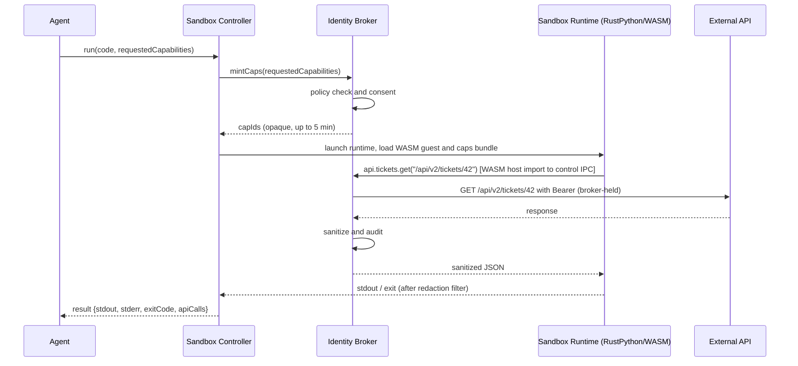
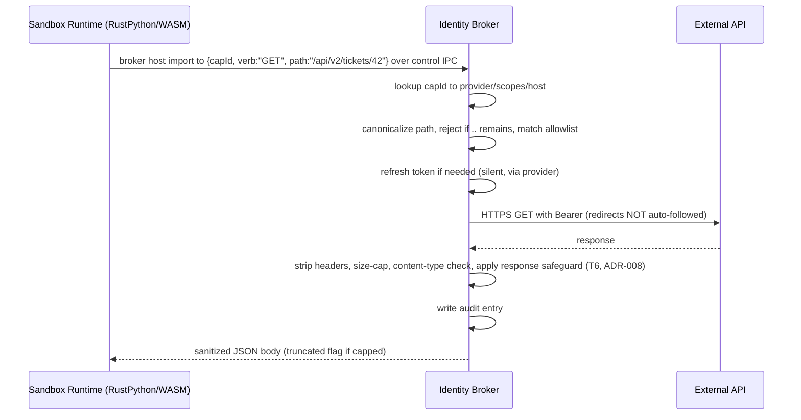
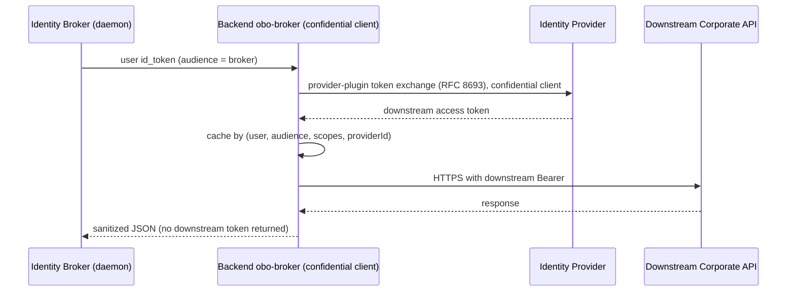
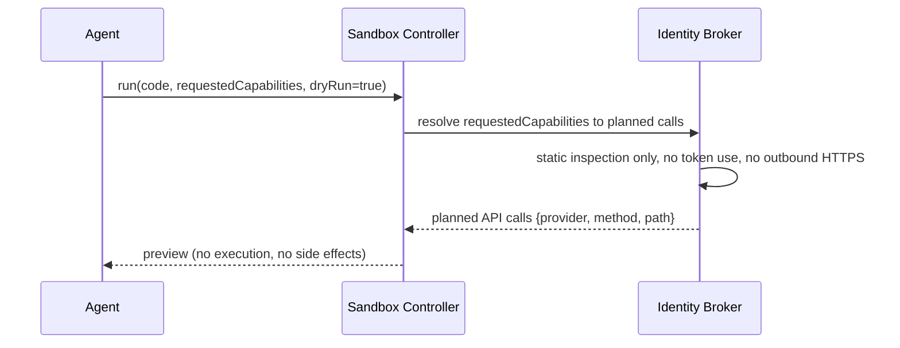
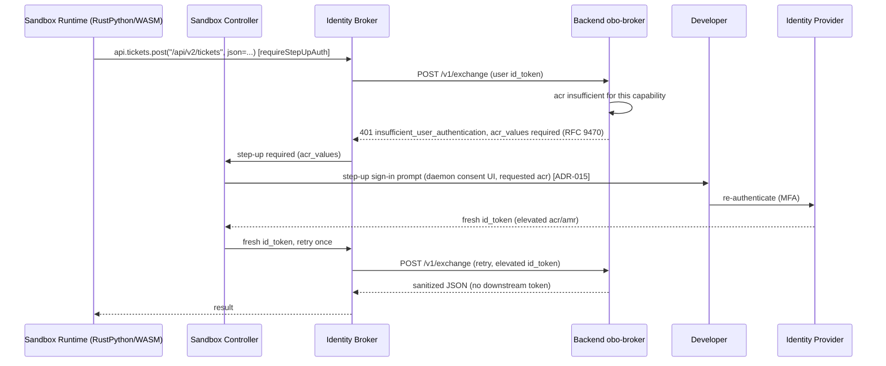
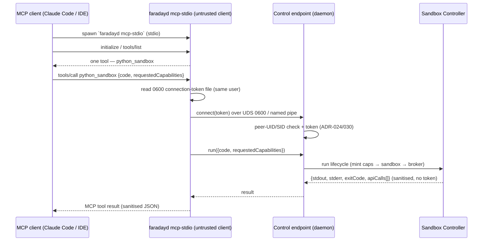

# 03 — Principal Sequences

## Sequence: Typical run (golden path)



- **Trigger:** the agent calls `run(code, requestedCapabilities)`.
- **Result:** the agent receives the program's redacted stdout/stderr, exit code, and a summary of the API calls made — never any token.
- **Error posture:** policy rejection fails before spawn; a capability not in policy is rejected; on token-refresh failure the broker returns a `401`-shaped error to Python with no token surfaced.

## Sequence: Authenticated API call (broker validation)



- **Trigger:** sandbox code invokes a `pysandbox_sdk` method, which calls the single broker host import; the Sandbox Runtime forwards it to the out-of-process broker over the control IPC.
- **Result:** sanitized JSON returned to the guest; the Bearer token never leaves the broker, and the guest never holds a socket.
- **Error posture:** path-traversal or off-allowlist path → rejected; cross-origin 3xx → returned as-is, `Authorization` never re-sent to a new host; response over cap → truncated with a flag; response content is marked untrusted before it reaches the agent (T6 safeguard, ADR-008).

## Sequence: Backend token exchange (corporate APIs via obo-broker)



- **Trigger:** sandbox code calls a capability whose provider routes to the backend `obo-broker` (e.g. via the `rfc8693` plugin).
- **Result:** the daemon (and therefore Python) sees only the final JSON; the privileged downstream token never reaches the workstation.
- **Error posture:** OBO is a **committed** component (OQ-6 resolved; ADR-005). If the backend is unreachable, token-exchange capabilities return a `503`-shaped error; capabilities not routed through the backend are unaffected. The backend's detailed design lives in [`../obo-broker/`](../obo-broker/README.md).

## Sequence: Dry-run preview (ADR-009)



- **Trigger:** a run requested with the dry-run flag set.
- **Result:** the agent (and the user, via the Copilot participant) sees the planned API calls the run *would* make, with no execution and no outbound traffic. **Caveat:** the preview is **static capability resolution** (ADR-009) — for arbitrary Python with data-dependent control flow it is a best-effort plan, **not** a guaranteed-complete inventory of every call the run might make; the enforced boundary is the allowlist at call time, not the preview.
- **Error posture:** dry-run never touches tokens or the network; if a requested capability is not in policy it is reported as `rejected` in the preview rather than failing a real call.

## Sequence: Step-up authentication on a sensitive capability (ADR-015)



- **Trigger:** the guest calls a capability whose policy sets `requireStepUpAuth` and the current `id_token` lacks the required `acr`.
- **Result:** after a one-time user step-up, the call proceeds; the assurance rides only in the `id_token` `acr` claim, server-enforced by `obo-broker` (ADR-014). The agent never asserts step-up and never sees a token.
- **Error posture:** the broker challenges with RFC 9470; the daemon retries **once** after step-up (ADR-015). A declined or failed step-up returns a typed `step_up_required`/`step_up_failed` error to the guest and the run does not proceed; the step-up signal is never a caller-supplied request field.

## Sequence: MCP client → `mcp-stdio` front door → daemon (ADR-028)



- **Trigger:** an MCP client invokes the `python_sandbox` tool. The shim is launched per session by the client and dies with it; the daemon is the always-on service (ADR-030).
- **Result:** the same `run` outcome the native RPC produces, wrapped as an MCP tool result. The shim relays only `{code, requestedCapabilities}` out and sanitised JSON back — **no token ever reaches the shim, the client, or the guest** (ADR-002/010/028).
- **Error posture:** if the daemon is not running, the shim returns a clear "daemon unavailable" tool error; a failed peer/token check is refused before any run (ADR-024). `interaction_required` is surfaced to the client while the daemon renders sign-in/consent/step-up.

## Sequence: Interactive sign-in — browser auth-code + PKCE on loopback (ADR-029)

```mermaid
sequenceDiagram
  participant Controller as Sandbox Controller
  participant UI as Consent/Auth UI (daemon)
  participant Loop as 127.0.0.1:&lt;ephemeral&gt; listener (daemon)
  participant Browser as System browser
  participant IdP as IdP (Dex / OIDC)

  Controller->>UI: interaction_required: sign_in
  UI->>UI: generate PKCE verifier+challenge, state, nonce
  UI->>Loop: bind transient 127.0.0.1 redirect listener
  UI->>Browser: open authorize URL (challenge, state, nonce, loopback redirect_uri)
  Browser->>IdP: user authenticates (+ MFA if step-up acr)
  IdP-->>Loop: redirect 127.0.0.1/?code=…&state=…
  Loop->>Loop: verify state; close port (single-use)
  UI->>IdP: token exchange (code + PKCE verifier)
  IdP-->>UI: id_token (+ verify nonce, signature)
  UI-->>Controller: id_token captured in daemon only
```

- **Trigger:** a run needs a user identity (or step-up) and none is held; the Controller raises `interaction_required: sign_in` (ADR-025).
- **Result:** the `id_token` is held **only in the daemon** (ADR-002/010); the agent/client/guest never see it. Step-up reuses this flow with the challenged `acr`. Targets generic OIDC discovery — Dex is the local-validation IdP.
- **Error posture:** PKCE + `state` + `nonce` + `127.0.0.1`-only + an ephemeral single-use port bound the redirect-interception surface; a `state`/`nonce` mismatch or an expired code aborts sign-in fail-closed and the run does not proceed. No local browser / loopback (remote/SSH topology) is out of scope — device-code is the recorded fallback (ADR-029).
