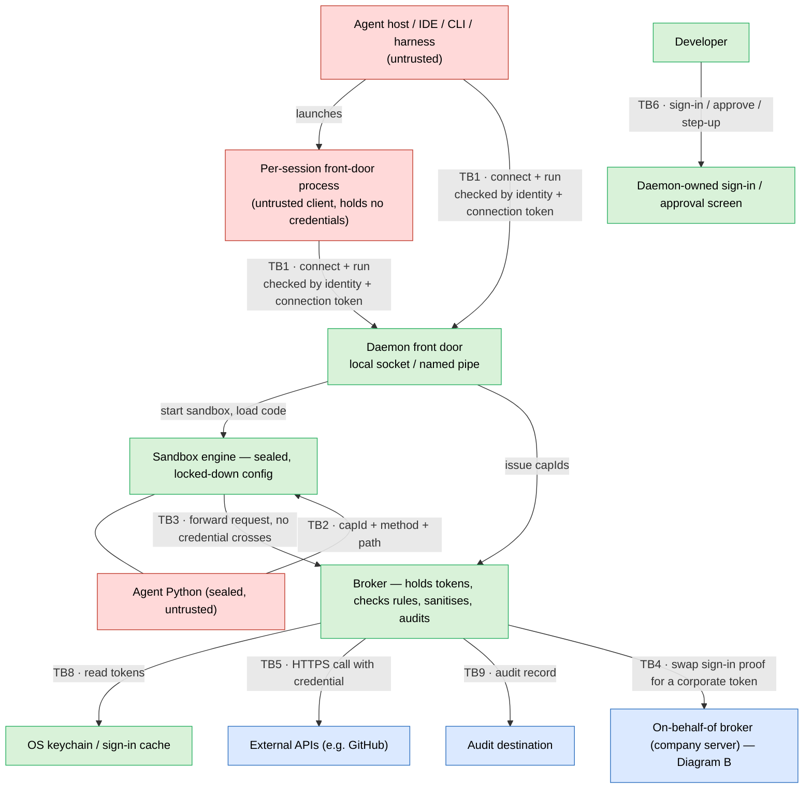
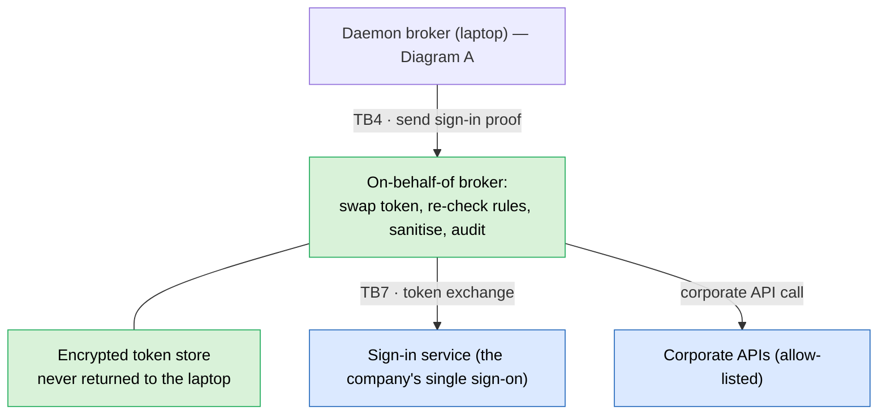
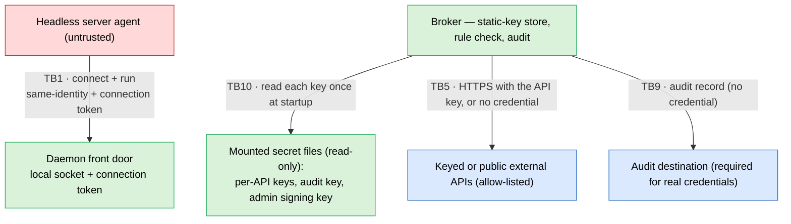

# Security Threat Model — `faradayd` and the on-behalf-of broker

An AI agent writes Python and wants it to call real APIs — GitHub, corporate services, keyed SaaS, public endpoints — on someone's behalf. The agent is untrusted and can be steered by prompt injection. The whole system exists to let that code reach approved APIs **without ever handing it the credentials those APIs need.**

This document is self-contained: it states each control in full so a reader needs no other file to follow it. It walks every trust boundary through a six-way checklist (below) and records what stops each kind of attack, which requirement that maps to, and what risk is left.

It covers **two ways the same program is deployed:**

- **Desktop:** the daemon runs as a developer's own operating-system user on their laptop. A human signs in; client tools reach the daemon over a local channel (a Unix-domain socket on macOS/Linux, a named pipe on Windows).
- **Server:** the daemon runs inside a container, **one daemon per agent service**, serving a headless agent with no human present. It adds two credential styles that need no sign-in (a static API key, or no credential at all) and replaces a human's "yes" with an administrator-signed policy.

Both share one program, one rule engine, one sandbox, and the same promise: credentials never reach the agent's code.

**Terms used below.**
- **capId** — a single-use, unguessable ticket the sandbox hands back to ask for one pre-approved action. It carries no secret and is worthless once used or after five minutes.
- **Broker** — the one part of the daemon that holds real credentials. It makes the API call itself and returns only the data, so the credential never leaves it.
- **On-behalf-of broker** — a separate company server that swaps a user's sign-in proof for a real corporate token and keeps that token on the server, never sending it to the laptop.
- **Auth mode** — the per-API rule for what credential to use: *exchange* (the company server swaps the sign-in proof for a corporate token), *passthrough* (use the user's own sign-in token directly), *api key* (a static key, server deployment), or *none* (no credential, server deployment).
- **Step-up** — forcing a fresh human re-authentication before a risky write.
- **Write gate** — every API rule is read-only (it may only fetch) unless an administrator-signed policy explicitly allows it to write.
- **Fail-closed** — on any error, missing rule, or uncertainty, deny.
- **Connection token** — a random secret the daemon writes at startup to a file only its own user can read; a client must present it to connect.
- **SR / RR / TB / Zn** — this document's own labels for requirements, residual risks, trust boundaries, and zones.
- The six-way checklist applied at each boundary: **Spoofing** (pretending to be someone), **Tampering** (altering data), **Repudiation** (denying you did it), **Information disclosure** (here, almost always a leaked credential), **Denial of service**, **Elevation of privilege** (gaining more than you were granted).

## 1. The system and the attacker

The daemon runs the agent's Python inside a sealed sandbox that has no network, no filesystem, and no way to start other programs. The only way out of the sandbox is a single door to the broker, which is the only component that holds credentials. The agent's host tools (an IDE, a CLI, a test harness, or a headless server agent) are thin clients: they connect over a local channel and ask the daemon to run code. One of those clients is a small front-door process the agent host launches per session to speak the agent-tooling protocol; it holds no credentials and connects like any other client.

- **The attacker:** the agent and the Python it writes, possibly under prompt injection.
- **Out of scope:** the person who owns the machine attacking their own machine — desktop user or server operator. The daemon already runs as them; they hold their own access.
- **The new exposure:** the daemon is always running, so any process that shares its identity (the same OS user on a laptop, or the same container on a server) can try to connect and drive it. The earlier IDE-extension model had nothing equivalent.
- **What changes on the server:** there is no human to sign in, approve, or re-authenticate, and the daemon may hold **static, long-lived API keys** in mounted files rather than only short-lived sign-in tokens. The "yes" a human would give is instead carried by an administrator's signature on the policy.
- **The one rule that never bends:** credentials never enter the agent's code, never return to the client, and corporate tokens never reach the laptop at all.

## 2. Assumptions

| ID | Assumption |
|---|---|
| A-1 | One daemon serves one identity — one OS user on a laptop, or one agent service in one container. A daemon is never shared across identities. |
| A-2 | A user's approvals are remembered only in memory, per client-and-workspace, and are never written to disk. (On the server there is no interactive approval — see A-9.) |
| A-3 | A human sign-in is needed only for the *exchange* and *passthrough* credential styles. A server deployment using only static keys or no-credential calls has no human and no sign-in; sign-in settings are required only when the policy actually contains a capability that needs them. |
| A-4 | The control channel is local only — a private socket on macOS/Linux or a private named pipe on Windows, in both cases reachable only by the daemon's own identity and gated by the connection token. The daemon never listens on the network. |
| A-5 | The policy file is the authorisation contract: it lists every allowed API by host, path, and method. Nothing not on the list is reachable. |
| A-6 | The bundled Python-in-sandbox build and all its dependencies are pinned and checked against a known fingerprint before they run. |
| A-7 | For APIs called with a direct credential, the daemon's broker is the only gate; for APIs that go through the company on-behalf-of server, that server re-checks the rules a second time. |
| A-8 | (Server) API keys are supplied as read-only mounted files the deployment manages. The daemon reads each once at startup into memory and never writes it anywhere else. There is one key per API rule. |
| A-9 | (Server) There is no human, so there is no interactive approval or step-up. Writes are pre-authorised by an administrator-signed policy; a policy that asks for step-up on a no-human capability is rejected when it loads. |
| A-10 | (Server) Operating with real credentials requires a working audit destination. Without one, the daemon refuses to use real credentials and runs in a mock-only mode that sends none. |
| A-11 | The container or host the server daemon runs in is trusted to the same degree as the keys mounted into it; a full container break-in is the operator compromising their own deployment, bounded by RR-6. |

## 3. Data flow and trust boundaries

Zones are grouped by trust: 🔴 untrusted, 🟢 trusted, 🔵 outside party or infrastructure. Arrows that cross a zone wall are the trust boundaries (`TBn`) examined in section 5. Read each diagram top to bottom; sanitised responses come back along the same arrows and are left out.

The whole laptop or container side is **one** program (the dashed box). Arrows inside it carry no boundary label because they cross no trust line. The new boundaries are **TB1** (a client reaching the daemon), **TB6** (a user at the approval screen, desktop only), and **TB10** (the broker reading a mounted secret, server only).

**How the daemon knows who is connecting (TB1).** On macOS and Linux the operating system tells the daemon which user owns the connecting process, and the daemon rejects any user that is not its own. On Windows the daemon briefly impersonates the connecting client, reads that client's security identifier (its SID), checks it is equal to the daemon's own, and immediately stops impersonating. It deliberately does **not** identify the caller by looking up a process ID, because process IDs are recycled and a different program could inherit one. On every platform the client must also present the connection token. The token file is readable only by the daemon's own user.

### Diagram A — laptop (desktop deployment)

### Diagram B — company server (on-behalf-of broker)

### Diagram C — container (server deployment)

The server deployment keeps the same client → daemon → sandbox → broker path, but there is **no human** (no sign-in or approval screen), and for static-key and no-credential APIs it **replaces** the company-server step with either a key read from a mounted file (**TB10**) or no credential at all. The agent and the daemon share one container and one identity.

## 4. Trust zones

| Zone | What it is | Trust |
|---|---|---|
| **Z0** | Agent / client (IDE, CLI, headless agent, front-door process) | Untrusted. Identified only by the operating-system identity behind the connection plus the connection token — never accepted as a named user of the daemon. |
| **ZU** | The user (desktop only) | Trusted on their own machine; signs in and approves. Absent on the server. |
| **Z1** | The agent's Python, sealed in the sandbox | Untrusted. Reaches the outside only through the one broker door. |
| **Z1r** | The sandbox engine | Trusted to hold the seal, but holds no credentials — breaking it yields none. |
| **Zctl** | The daemon front door: connection, caller check, sessions | Trusted; enforces the client-to-daemon boundary. |
| **Zui** | Sign-in / approval screen (desktop only) | Trusted; the only thing that can decide the user said yes. |
| **Z3** | The broker | Trusted; holds every credential (sign-in tokens, or static keys on the server) and owns the rules. |
| **Z3b** | OS keychain / sign-in cache (desktop) | Trusted; where sign-in tokens rest. |
| **Zsec** | Mounted secret files (server only) | Trusted; read-only files holding the static API keys, the audit key, and the admin signing key. |
| **Zobo** | The company on-behalf-of broker | Trusted, server-side; holds the corporate credential. |
| **ZIdP** | The sign-in service | Trusted outside party. Used only by the *exchange* and *passthrough* styles. |
| **ZX** | External, corporate, keyed, or public APIs | Outside; only allow-listed hosts are reachable. |

## 5. Trust boundaries

The **SR** column links each defence to the requirement it satisfies (section 6). Only the relevant checklist rows are listed.

### TB1 — a client reaches the daemon front door. *The central new exposure.*
Any process that shares the daemon's identity (same OS user on a laptop, same container on a server) can reach the channel. The job is to obey only the approved client, and to keep even an unapproved same-identity caller within what that identity could already do anyway. The per-session front-door process is one such client and is held to every defence below.

| | Threat | Defence | SR |
|---|---|---|---|
| Spoofing | A process that is not the approved client drives the daemon — issues caps, replays a leaked capId | The daemon checks who is connecting using the operating system, not the caller's word: the connecting user's identity on macOS/Linux, or the connecting client's security identifier on Windows (read by briefly impersonating it, never by a recyclable process-ID lookup). It must also present the connection token, and a brand-new client identity prompts a first-time approval. | SR-1, SR-3, SR-24 |
| Tampering | A malformed run request — oversized code, bad cap ids, injected fields | Strict parsing that rejects unknown fields, a code-size cap, and a fixed cap-id shape; "step-up was done" can never be a field in the request. | SR-6 |
| Repudiation | A client denies it asked for a run | Each call is recorded with a server-generated run id, a one-way hash of the user id (or a fixed service identity when headless), and the identity the operating system verified. The self-declared tool name is only a hint. | SR-9 |
| Information disclosure | Another same-identity process reads the connection token | The token file is readable only by the daemon's own user. That a same-identity process can read it is the one accepted residual (RR-2) — it is the identity's own authority. | SR-1, SR-24 |
| Denial of service | A client floods the run entry | Per-run and per-session call budgets; the sandbox's own CPU and time limits cap any single run. | SR-8 |
| Elevation | A same-identity caller goes from connecting to actually *using* a credential | Credentials never cross the channel (only a capId, a method, and a path do); approval (desktop) or the administrator-signed write gate (server), plus the allow-list, budgets, and audit, hold it to exactly the granted actions. | SR-2, SR-4, SR-27 |

### TB2 — the agent's Python reaches the sandbox engine. *The seal.*

| | Threat | Defence | SR |
|---|---|---|---|
| Spoofing | Forge or guess a capId to act as another capability | A capId is an unguessable single-use 128-bit value; the broker, not the sandbox, resolves it to a real target. | SR-5 |
| Tampering | Path traversal or method injection in the request | The sandbox door rejects `..` and anything off the method allow-list, and the broker re-checks, fail-closed. | SR-6, SR-22 |
| Information disclosure | Open a socket to slip past the broker | The sandbox has no socket capability at all — the only way out is the single broker door. | SR-7 |
| Denial of service | Runaway code — endless loop, runaway regex, memory bomb | Hard CPU, wall-clock, and memory limits per run; floods bounded by call budgets. | SR-8 |
| Elevation | Escape via foreign-function or subprocess tricks | The sandbox has no foreign-function or process machinery to call; the only remaining risk is a flaw in the sandbox engine itself (RR-1). | SR-7 |
| Elevation / disclosure | Trick the door into over-reaching | The door exposes one function and re-derives the real target from the capId through the broker, never from text the guest supplies. | SR-22 |

### TB2a — the sandbox engine's configuration and supply chain

| | Threat | Defence | SR |
|---|---|---|---|
| Tampering | A configuration mistake grants the sandbox a dangerous capability and breaks the seal | The sandbox configuration is least-privilege, fixed by the trusted code (the guest cannot influence it), and re-checked fail-closed at startup. | SR-20 |
| Tampering | A swapped build or a malicious dependency | The build and its whole dependency tree are pinned, fingerprint-checked before they run (including the Windows-only dependencies), and never loaded dynamically; an automated check rejects known-bad dependencies. | SR-21 |

### TB3 — the sandbox engine reaches the broker

| | Threat | Defence | SR |
|---|---|---|---|
| Information disclosure | Get a credential sent back into the sandbox | The broker makes the call itself and returns only sanitised data; no credential — sign-in token or static key — ever leaves the broker. | SR-4 |
| Elevation | A broken sandbox tries to exceed its grant | The broker independently re-checks the capId, the allow-list, the budgets, and the write gate, and holds no credentials of its own to steal — an escape is a local foothold, not a theft. | SR-22 |

### TB4 — the broker reaches the on-behalf-of broker. *Exchange style only.*

| | Threat | Defence | SR |
|---|---|---|---|
| Information disclosure | A corporate token lands on the laptop | The company server does the swap and never returns the token — only sanitised data comes back. | SR-4 |
| Elevation | Skip step-up on a risky write | The server answers with a step-up challenge; the daemon prompts the user and retries once. The caller can never claim step-up itself. | SR-3 |

### TB5 — the broker reaches external, keyed, or public APIs
Covers *passthrough* (the user's own token), *api key* (a static key), and *none* (no credential).

| | Threat | Defence | SR |
|---|---|---|---|
| Spoofing | A redirect hands the credential to an attacker's host | Cross-host redirects are not followed; the credential is never re-sent to a new host. | SR-6 |
| Tampering | An off-allow-list host, path, or method; an unintended write | Host, exact path, and method must all be on the allow-list, fail-closed; and every API rule is **read-only unless an administrator-signed policy allows it to write**. | SR-6, SR-2, SR-27 |
| Information disclosure | A credential leaks through a response or error | Responses are sanitised (headers stripped, size-capped) and marked untrusted; the credential is attached by the broker and never echoed back. | SR-4, SR-12 |
| Information disclosure | A static key is sent to the wrong host | A key is bound to one API rule's exact host, path, and method, and used only on that call; one key per rule. | SR-26 |

### TB6 — the user reaches the approval / sign-in screen. *Desktop only.*
Approvals are decided by the daemon's own screen, so the agent can never claim the user said yes. The server deployment has no human and therefore no TB6 — see TB10 and SR-27 for how permission is granted there.

| | Threat | Defence | SR |
|---|---|---|---|
| Spoofing | A client fakes an "approved" signal | The daemon's own screen renders and decides sign-in, approval, and step-up; the caller supplies no result. | SR-3 |
| Spoofing | A client shows a misleading tool name so the user approves thinking a trusted tool is asking | The dialog shows the real grant — host, methods, whether step-up applies, and which provider — and the user, not the displayed name, decides. The tool name is an unverified hint. Only a same-identity caller can do this (RR-2); the accepted residual is RR-5. | SR-25 |
| Tampering | An approval silently widens across sessions | Remembered only in memory, per client-and-workspace, never written down. | SR-2 |
| Information disclosure | A phished or forged sign-in | Sign-in happens on the daemon's own local page, and the resulting proof is locked so that only the broker will accept it. | SR-1 |
| — | A headless caller hits a risky write | On the desktop it fails closed unless already approved or mocked. On the server, writes are permitted only by an administrator-signed policy (SR-27). | SR-3, SR-27 |

### TB7 — the on-behalf-of broker reaches the sign-in service

| | Threat | Defence | SR |
|---|---|---|---|
| Spoofing | A forged sign-in proof is presented | The issuer, the signature, and the intended audience are all validated, then re-checked independently. | SR-1 |
| Information disclosure | Stored corporate tokens are disclosed | Encrypted under a managed key and never returned to the laptop. | SR-4 |

### TB8 — the daemon reaches the OS keychain. *Desktop sign-in.*

| | Threat | Defence | SR |
|---|---|---|---|
| Tampering | An on-disk token cache is tampered with | Read through the operating system's keychain / sign-in session only, and never copied into the sandbox. | SR-10 |

### TB9 — audit records reach the audit destination

| | Threat | Defence | SR |
|---|---|---|---|
| Repudiation | Local log tampering hides what happened | The local log is best-effort; the central audit export is the authoritative record and is required when real credentials are in use — without it the server falls back to mock-only. | SR-9, SR-18 |
| Information disclosure | The audit log leaks credentials or bodies | It stores only sizes and a one-way hash of the user id; keys, tokens, and bodies are never logged, and verbose body-logging is off by default and refused under real credentials. | SR-18, SR-26 |

### TB10 — the broker reaches the mounted secret files. *Server only; new.*
On the server the static API keys (and the audit and admin-signing keys) live in read-only files the deployment mounts in. The broker reads each once at startup into memory; it is never re-read at runtime, never written anywhere else, never returned to the guest, and never logged.

| | Threat | Defence | SR |
|---|---|---|---|
| Information disclosure | A static key sits at rest and a container intruder reads it | Keys are deployment-managed read-only files, scoped to one API rule, never copied to other storage, never logged or returned. A full container break-in that reads them is the operator-compromise case (A-11), bounded by the per-rule allow-list, call budgets, and key rotation (RR-6). | SR-26 |
| Tampering | A swapped or poisoned key file | A key that cannot be read at startup fails closed; an API rule whose key is missing fails its calls closed rather than calling with no credential. | SR-26, SR-2 |
| Elevation | An unsigned policy grants itself a writable or keyed rule | Policy changes are accepted only with a valid administrator signature; an unsigned or invalid change falls back to the shipped default, and writing is allowed only in a signed policy. | SR-25, SR-27 |

## 6. Security requirements

**P0** = load-bearing (its failure breaks the core promise); **P1** = defence-in-depth. *Why it matters* is what an attacker gains without it; *Boundaries* is where it is enforced (section 5).

| ID | Pri | Requirement | Why it matters | Boundaries |
|---|---|---|---|---|
| **SR-1** | P0 | For the sign-in-based styles, the user's identity comes from a real sign-in, and the resulting proof is restricted so only the broker accepts it. The calling tool is never accepted as a user — connections are identified only by the operating-system identity behind them plus the connection token. | If the client could authenticate as the user, every other control could be bypassed just by asking. A real human sign-in is the root of trust the rest depends on. | TB1, TB6, TB7 |
| **SR-2** | P0 | Every outbound call is checked against the allow-list (host, path, method) by the broker, and a second time on the company server for exchange calls. If the policy cannot load, deny everything; the only accepted overrides are administrator-signed. | Without a positive allow-list a compromised agent could reach anything a credential happens to permit. Checking both sides, and failing closed, stops one compromise or a missing policy from widening access. | TB1, TB5, TB6, TB10 |
| **SR-3** | P0 | Risky writes require a fresh human re-authentication where a human exists, and the proof of it can never be claimed by the caller. With no human (server), step-up does not apply and is rejected; writes are gated by SR-27 instead. | Writes are the highest-impact action and the prime target for a hijacked agent. A re-auth the agent cannot forge — or, headless, an administrator's signature — keeps one bad run from making destructive writes. | TB1, TB4, TB6 |
| **SR-4** | P0 | Raw credentials never enter the agent's code or return to the client, and corporate tokens never reach the laptop at all. | One stolen credential lets an attacker act as the principal against real APIs. Keeping custody in the broker — and corporate tokens entirely on the server — means even a full sandbox break yields nothing reusable. This is the central promise. | TB1, TB3, TB4, TB5, TB10 |
| **SR-5** | P0 | The handles the guest holds are opaque, single-use, expire within five minutes, and are tied to one running daemon. | A short-lived single-use unguessable handle is worthless almost at once if leaked — what the guest holds is never a credential in disguise. | TB1, TB2 |
| **SR-6** | P0 | Outbound paths are normalised and rejected on `..`; host and method must be allow-listed; cross-host redirects are not followed and the credential is never sent to a new host. | These are the classic ways a vetted call becomes an unintended one — traversal to a forbidden resource, or a redirect that hands the credential to an attacker. | TB1, TB2, TB5 |
| **SR-7** | P0 | The guest has no socket, filesystem, or process capability; its only way out is the single broker door, so it cannot reach the network on its own. | If untrusted code could open its own connection it could send data out directly, around every custody control. Removing the capability leaves no egress path to misconfigure. | TB2 |
| **SR-8** | P1 | Each run and session is bounded by hard limits: CPU, wall-clock, memory, and a cap on broker calls. | Untrusted code can loop forever, allocate without limit, or flood the broker; runtime ceilings stop one run denying service. | TB1, TB2 |
| **SR-9** | P1 | Every run and call is recorded with a server-generated run id, a one-way hash of the user id (or a fixed service identity when headless), and the operating-system-verified caller identity; the central export is authoritative. The tool name is an unverified hint. | When the agent is the attacker, a tamper-resistant account of what was done, and under whose authority, is essential; a central copy cannot be erased by local tampering. | TB1, TB9 |
| **SR-10** | P1 | The guest gets no host environment; its capabilities arrive only through the broker door (never as host files); its memory is wiped at the end of each run. | Secrets leak through stray inputs — environment values, files, leftover memory. Denying all of them closes those side channels. | TB2, TB8, TB10 |
| **SR-12** | P1 | API responses come back in a typed wrapper marked untrusted and are never automatically fed back into the model. | Response bodies are attacker-influenced and the main carrier for prompt injection (RR-3); refusing to auto-feed them stops a poisoned response steering the next action. | TB5 |
| **SR-18** | P1 | The audit trail never contains credentials or bodies — only sizes and a one-way hash of the user id; verbose body-logging is off by default and refused under real credentials. | An audit log is useless as a control if it becomes a second place secrets leak. | TB9, TB10 |
| **SR-20** | P0 | The sandbox configuration is least-privilege, fixed by the trusted code, and re-checked fail-closed at startup; no ambient capabilities are granted. | The sandbox is only as strong as its configuration; one accidental grant collapses SR-7. Fixing it in trusted code makes the seal a checked property, not an assumption. | TB2a |
| **SR-21** | P0 | The sandbox build and its whole dependency tree are pinned, fingerprint-checked before they run, and dependency-gated (including the Windows-only dependencies); nothing is loaded dynamically. Signing the installer is a supported, optional step. | A swapped interpreter or a malicious dependency would run with the sandbox's trust and could undermine every other control from the inside. Pinning and verifying make a tampered build detectable before it runs. | TB2a |
| **SR-22** | P0 | The broker independently re-enforces authorisation — the capId, the allow-list, the budgets, the write gate — treating the sandbox as untrusted, so an escape can neither exceed the grant nor steal a credential. | The sandbox seal is the only isolation boundary, so the design must survive its failure; re-checking where no credentials are visible turns an escape into a contained foothold. | TB2, TB3 |
| **SR-24** | P0 | The client-to-daemon boundary identifies the caller through the operating system — the connecting user on macOS/Linux, the connecting client's security identifier on Windows (read by impersonation, never by a recyclable process-ID lookup) — plus the connection token, and confines even a same-identity caller to the same approvals or write gate, allow-list, budgets, and audit as any client. Confirmed by a dedicated penetration test on each platform. | The always-on daemon is a new, always-available target any same-identity program can reach. Connecting must buy no more authority than that identity already holds — load-bearing enough to warrant its own test. | TB1 |
| **SR-25** | P0 | The shipped policy can be overridden only by an administrator-signed change; an unsigned or invalid one falls back to the shipped default, and (desktop) the approval dialog shows the host, methods, step-up, and provider being granted. | Per-project policy is a tempting injection point — a malicious repository could ship a policy widening its own access. A required signature keeps control of the allow-list with administrators. | TB1, TB6, TB10 |
| **SR-26** | P0 *(server)* | Static API keys are deployment-managed read-only files, read once at startup into memory, scoped to one API rule's host/path/method, never written elsewhere, never logged or returned to the guest, and applied only by the broker; an unreadable key fails closed. | The server introduces static, long-lived secrets the desktop never had. Tight scoping, never-logged custody, and failing closed bound what a leaked or missing key can do; the at-rest exposure under a container break-in is RR-6. | TB5, TB9, TB10 |
| **SR-27** | P0 | Every API rule is read-only (fetch only) unless an administrator-signed policy explicitly marks that rule as allowed to write; enforced when the policy loads and re-checked on every call. | With no human to approve a write, the administrator's signature is the substitute permission, and read-only-by-default ensures a careless or unsigned policy cannot silently enable destructive calls. | TB1, TB5, TB10 |

## 7. Does the design meet its requirements?

This section scores **design completeness** — is each control fully specified — not whether code is in production. A separate set of activities still has to be done before real credentials (section 7.1a): a sandbox-escape penetration test, the client-auth penetration test on each platform, and producing a signed production build. Code now exists and the automated checks on both Linux and Windows pass (build, lint, the integration suite with real supporting services, the dependency gate, and the Windows client-auth penetration test); a dedicated sandbox-escape test and a signed build remain.

| Req | Pri | Status | How the design meets it |
|---|---|---|---|
| SR-1 | P0 | ✅ Met | Sign-in happens on the daemon's own page for the sign-in-based styles, and the resulting proof is locked so that only the broker will accept it; the tool is never an identity — connections are identified only by operating-system identity plus the connection token. The static-key and no-credential styles have no user by design (A-3). |
| SR-2 | P0 | ✅ Met | The broker checks host, path, and method on every call, and the company server re-checks for exchange calls; a policy that cannot load denies everything; only administrator-signed overrides are accepted. |
| SR-3 | P0 | ✅ Met | A risky write triggers a step-up challenge and a daemon-rendered re-auth where a human exists; with no human it is rejected at load, and SR-27 is the substitute. |
| SR-4 | P0 | ✅ Met | The broker makes each call itself and returns only sanitised data; corporate tokens stay on the company server; static keys stay in the broker and are applied by it alone. |
| SR-5 | P0 | ✅ Met | The guest holds only an opaque single-use handle, valid five minutes, tied to one daemon; only the broker can turn it into a real target. |
| SR-6 | P0 | ✅ Met | Paths are normalised and `..` rejected; host and method must be allow-listed; cross-host redirects are not followed and the credential is never re-sent to a new host. |
| SR-7 | P0 | ✅ Met (design) · RR-1 test pending | The guest has no socket, filesystem, or process capability, so it cannot reach the network on its own. Whether the engine itself can be escaped is the RR-1 test. |
| SR-8 | P1 | ✅ Met | CPU, wall-clock, memory, and broker-call limits per run and session. |
| SR-9 | P1 | ✅ Met | A server-generated run id, a one-way hash of the user id (or a fixed service identity when headless), and the verified caller identity per call; the central export is authoritative. |
| SR-10 | P1 | ✅ Met | No host environment; capabilities arrive only through the broker door; memory wiped per run. |
| SR-12 | P1 | ✅ Met (control) · RR-3 accepted | Responses are wrapped, marked untrusted, and never auto-fed back; the leftover is the accepted prompt-injection residual RR-3. |
| SR-18 | P1 | ✅ Met | Only sizes and a one-way hash of the user id are recorded; keys, tokens, and bodies never are; verbose logging is off by default and refused under real credentials. |
| SR-20 | P0 | ✅ Met | A least-privilege sandbox configuration fixed by the trusted code and checked fail-closed at startup. |
| SR-21 | P0 | ✅ Met | The build and its whole dependency tree are pinned, fingerprint-checked before running, dependency-gated (including the Windows-only dependencies), and never loaded dynamically. Installer signing is supported as an optional, off-by-default step — a complete design choice; actually producing the signed build is the activity in section 7.1a, and the unsigned-by-default first-run posture is the accepted residual RR-9. |
| SR-22 | P0 | ✅ Met | The broker re-checks the handle, allow-list, budgets, and write gate and holds no credentials, so even a full sandbox break is a contained foothold. |
| SR-24 | P0 | ✅ Met (design) · tests: Windows automated, Unix pending | The boundary identifies the caller through the operating system plus the connection token and confines a same-identity caller to the granted actions. The Windows client-auth penetration test runs automatically; the equivalent Unix one is still to be run (RR-2). |
| SR-25 | P0 | ✅ Met | Overrides require a valid administrator signature; unsigned or invalid ones fall back to the default; the desktop approval dialog shows the full grant. |
| SR-26 | P0 *(server)* | ✅ Met | Per-rule mounted-file keys read once at startup, scoped to one host/path/method, never persisted/logged/returned, failing closed when unreadable. |
| SR-27 | P0 | ✅ Met | Read-only by default; writing needs an explicit administrator-signed mark on that rule; enforced at load and re-checked per call. |

### 7.1 Outstanding design items
None at the requirement level — all controls are specified across both deployments. The one open *decision* in the wider system is whether to bind the inbound sign-in proof to its sender and cap its age; that lives in the on-behalf-of broker's own documentation.

### 7.1a To prove before production
- **The sandbox-escape penetration test (RR-1).** The sandbox engine is the only isolation boundary by choice; that assumption must be tested before real credentials. Until then: mock or non-sensitive only.
- **The client-auth penetration test (SR-24 / RR-2).** The Windows test runs automatically; run the equivalent on Unix and confirm a same-identity driver really is held to the granted actions.
- **The signed build (SR-21 / RR-9).** Produce the reproducible, signed installer for each platform; it is unsigned/ad-hoc by default today.

### 7.2 Verdict
All controls are specified across the desktop and server deployments. The new boundaries — a client reaching the daemon (both platforms), the user at the approval screen (desktop), and the broker reading mounted secrets (server) — are each controlled. A complete design is not production readiness: real credentials additionally require the section 7.1a activities. Until then the posture is real credentials only behind the passing tests and a signed build, mock-only before.

## 8. Residual risks

- **RR-1 — Sandbox engine escape.** The engine is the only isolation boundary, by choice, with no operating-system sandbox behind it. Contained: it holds no credentials and the broker re-enforces the rules, so an escape is a local foothold as the (already-undefended) identity, not a theft. Confirmed by a dedicated penetration test before production.
- **RR-2 — A same-identity local driver.** Another process sharing the daemon's identity can read the connection token and drive the daemon. Bounded: credentials never cross the channel, and approval (or the write gate) plus the allow-list, budgets, and audit hold it to the granted actions — the identity's own authority. Confirmed by the SR-24 tests. Removing it entirely would need a per-client credential gated by the OS keychain.
- **RR-3 — Prompt injection in returned content.** Cannot be removed while the system's purpose is to return API data. Bounded by the untrusted wrapper and never auto-feeding responses back. Owner named at approval.
- **RR-4 — Moving data between two granted capabilities in one run.** Within one approved, budgeted, audited run the agent can move data between two capabilities the user already authorised. Bounded by step-up (desktop) or the write gate (server) on write destinations, plus budgets and audit.
- **RR-5 — Unverified tool name.** The tool name a client presents is not verified — on the front-door path the connecting program is always the daemon's own front door, so the daemon cannot tell which tool launched it. Bounded: only a same-identity process can set a name, every action is still tied to the verified caller identity and a server-generated run id, and the name changes no API access. Residual: cross-tool audit attribution and the displayed tool name in the approval dialog are spoofable by a same-identity caller. Attribution to an *identity* is sound; to a *tool* it is advisory.
- **RR-6 — A static key at rest (server).** With static keys the daemon holds long-lived secrets in mounted files and in memory for its lifetime; a full container break-in reads them. Bounded: each key is scoped to one allow-listed host/path/method, never logged or returned, call budgets cap the blast radius, and rotation is the deployment's job. This is the operator-compromise case; accepted for single-tenant controlled deployments. Owner named at approval.
- **RR-7 — No-credential calls (server).** No-credential API rules reach public endpoints with no credential. Bounded: still allow-listed, read-only unless signed for write, budgeted, and audited; the policy author must list each endpoint explicitly. Residual: an agent can drive any listed public endpoint within budget — the authority the policy already grants.
- **RR-8 — An over-broad signed write grant (server).** Because headless writes are permitted by signature rather than by a human, a careless signed policy could enable unintended writes. Bounded: read-only by default, an explicit per-rule write mark, a required signature, and every write still allow-listed and audited. The residual is administrative, not technical.
- **RR-9 — Unsigned-installer first-run trust.** Installers ship unsigned/ad-hoc by default, so the operating system warns on first run and the install guidance trains users to override that warning. Bounded: documented as an interim posture for first-party/internal testing; signing is a supported step that turns on with no structural change once certificates exist. Accepted interim residual.

## 9. Coverage summary

Every boundary passes the six-way checklist across both deployments. The material additions over the earlier model are the three new boundaries: a client reaching the daemon (identified by OS user on Unix and by security identifier on Windows), the user at the approval screen (desktop), and the broker reading mounted secrets (server). The controls needing a pre-production penetration test are the sandbox escape (RR-1) and client auth (SR-24 / RR-2 — automated on Windows, pending on Unix); the outstanding build activity is the signed installer (SR-21 / RR-9). Every residual risk has a named control and a bounded, accepted residual; every load-bearing requirement maps to at least one boundary.

## 10. Downstream MCP mediation (ADR-034)

This section extends the approved model to the daemon acting as an MCP *client* of allowlisted upstream MCP servers — distinct from its existing role as the inbound MCP *server* (ADR-028), which is unaffected. The decision is **accepted at design level ([ADR-034](../design/sandbox-daemon/09-decisions.md))**; the detailed mechanics (multi-part-result sanitisation, the `toolAllow` schema, per-argument constraints) are specified in `/spec`, and **no code exists yet** — sections 1–9 remain the implemented-and-tested baseline. The scope is **HTTP/SSE-transport downstream MCP servers only** — stdio-transport is explicitly out of scope (RR-10).

**Why it fits the existing model.** A downstream MCP server reached over HTTPS is, to the broker, an external API on the allow-list (TB5): a credentialed `POST` to one allowlisted origin. Two deltas distinguish it, and TB11 below records only those. Everything else — credential custody (SR-4), the allow-list and fail-closed posture (SR-2), cross-host-redirect refusal (SR-6), audit (SR-9/SR-18), and the laptop-vs-server credential split (TB4/TB5/TB10) — carries over **unchanged**.

### TB11 — the broker reaches a downstream MCP server. *The MCP analogue of TB5.*
The request is a JSON-RPC `tools/call` rather than a REST verb-and-path, so the allow-list unit is **server origin + tool name** instead of host + path + method; and the response is **multi-part MCP content** (text, structured content, embedded resource, resource link, image) rather than a single body. The credential is attached by the broker to the HTTPS call exactly as in TB5 and never crosses into the guest.

| | Threat | Defence | SR |
|---|---|---|---|
| Tampering | The agent calls a downstream tool that is not meant to be reachable | The capability lists an explicit `toolAllow` set; a tool not on it is rejected fail-closed. The server's own advertised `tools/list` is treated as data, never as the authorisation surface. | SR-2, SR-28 |
| Information disclosure | A credential leaks through a multi-part MCP result or a resource link | Every result part comes back in the untrusted wrapper, size-capped, never auto-fed to the model; resource links and embedded-resource URIs are returned as data and never auto-dereferenced by the broker. The credential is attached by the broker and never echoed. | SR-4, SR-12, SR-28 |
| Spoofing | A redirect hands the MCP credential to an attacker host | Cross-host redirects are not followed and the credential is never re-sent to a new host (same rule as TB5). | SR-6 |
| Elevation | A swapped or compromised upstream advertises new tools to widen its reach | A new advertised tool changes nothing: only `toolAllow` entries are callable, and the allow-list is admin-signed (SR-25), so the upstream cannot widen its own grant. | SR-25, SR-28 |

### Requirement

| ID | Pri | Requirement | Why it matters | Boundaries |
|---|---|---|---|---|
| **SR-28** | P0 | A downstream MCP capability is reached over HTTPS only; the broker holds the credential and the guest never sees it; the callable surface is a static, admin-signed `toolAllow` set (never the server's advertised `tools/list`); every result part is returned in the untrusted wrapper, size-capped, never auto-fed to the model, and resource links are never auto-dereferenced. stdio-transport downstream MCP is not permitted (RR-10). | MCP servers are a growing class of credentialed upstreams; reaching them outside the broker leaks the credential (the SR-4 failure), and trusting a server-controlled tool list would hand the authorisation boundary to the upstream. | TB11 |

### Residual

- **RR-10 — stdio-transport downstream MCP deferred.** A downstream MCP server that speaks only stdio would require the daemon to spawn and supervise a native, OS-privileged child process outside any sandbox — reintroducing the ambient-authority surface ADR-013 removed, inside the credential-holding daemon. ADR-034 puts it out of scope. Bounded by exclusion: there is no stdio-spawn code path; a deployment needing such a server must front it with an HTTP transport or wait for a separate decision. Not a residual of a shipped control — a deliberate scope boundary.

**Assumption extension (A-5).** For an MCP capability the allow-list lists the server origin and the permitted tool names; nothing not on the `toolAllow` set is reachable, the same fail-closed contract A-5 states for REST host/path/method.
