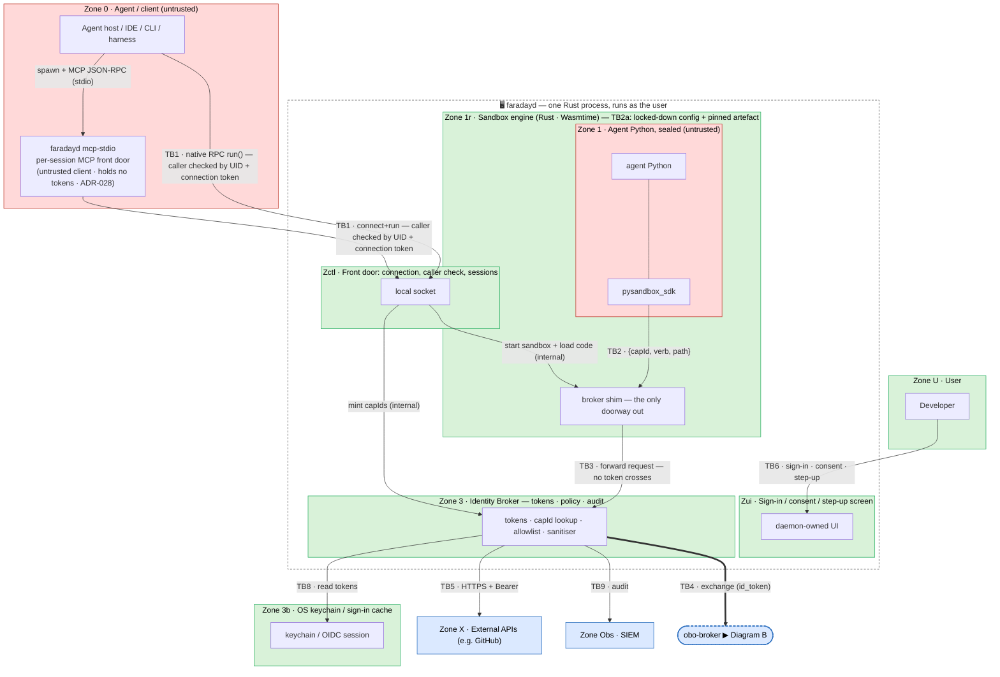
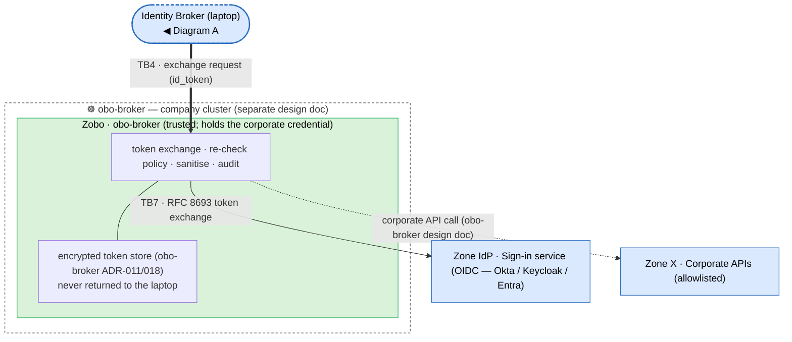

# Security Threat Model — `faradayd` (sandbox daemon) + `obo-broker`

An AI agent writes Python and wants it to call real APIs — GitHub, corporate services — on the user's behalf. The agent is untrusted and may be steered by prompt injection. The entire design exists to let that code reach approved APIs **without ever handing it the tokens those APIs require.**

This document walks every trust boundary in the system through STRIDE and records what stops each class of attack, which requirement that maps to, and what risk is left over.

**Terms used below.** 
- `capId` — an unguessable, single-use ticket the sandbox presents to request one pre-approved action; it carries no secret. 
- **Identity Broker** — the only component holding real tokens; it makes API calls itself rather than handing tokens out. 
- **`obo-broker`** — a company-server component that exchanges the user's sign-in proof (`id_token`) for a corporate token and keeps that token server-side. 
- **Step-up** — a forced re-authentication before a sensitive write. 
- **Fail-closed** — on any error or missing rule, deny. 
- **ADR-NNN** — a numbered design decision in the design folders. 
- **SR / RR / TB / Zn** — this document's labels for requirements, residual risks, trust boundaries, and zones.
- **STRIDE** is the six-way checklist applied at each boundary: **S**poofing (impersonation), **T**ampering (altering data), **R**epudiation (denying an action), **I**nformation disclosure (here, almost always a token leak), **D**enial of service, **E**levation of privilege.

## 1. System and adversary

`faradayd` is a per-user Rust daemon. It runs the agent's Python inside a WebAssembly sandbox (RustPython on Wasmtime) that has no network, filesystem, or process access of its own, and lets that code reach only allowlisted APIs through one gatekeeper — the in-daemon Identity Broker. Corporate token exchange is delegated to the server-side `obo-broker`. The tools the agent runs under (IDE, CLI, harness) are thin clients that connect over a local socket — either directly over the faraday-native RPC, or by spawning the `faradayd mcp-stdio` front door (an MCP JSON-RPC subprocess, ADR-028) — and ask the daemon to `run` code.

- **Adversary:** the agent and the Python it writes, possibly under prompt injection.
- **Out of scope:** the user attacking their own machine (ADR-002). The daemon runs as them; they already hold their own access.
- **New surface in this design:** the daemon is long-lived, so any same-UID process can try to connect and drive it (**TB1**). The old extension model had no equivalent.
- **The one invariant:** tokens never enter the agent's code, and corporate tokens never reach the laptop at all.

## 2. Assumptions

| ID | Assumption |
|---|---|
| A-1 | One daemon per OS user, running under that user's UID; no cross-user sharing. |
| A-2 | Consent is cached in memory per `(client, workspace)` session, never persisted. |
| A-3 | The user has signed in (OIDC); the `id_token` stays inside the daemon (ADR-002 / ADR-010). |
| A-4 | The control socket is local-only — UDS `0600` or a per-user named pipe. No network listener. |
| A-5 | `pysandbox.policy.json` is the authorisation contract; its schema is `sandbox-daemon/11-policy-schema.md` + `sandbox-daemon/schema/pysandbox.policy.schema.json`. |
| A-6 | The bundled RustPython/WASM artefact and crate tree are pinned, digest-checked, and verified before instantiation (ADR-018). |
| A-7 | For direct providers (e.g. `github`) the daemon broker is the sole gate; for token-exchange providers `obo-broker` re-checks server-side. |

## 3. Data flow and trust boundaries

Zones are grouped by trust: 🔴 untrusted, 🟢 trusted, 🔵 external party or infrastructure. Labelled arrows crossing a zone wall are the trust boundaries (`TBn`) examined in §5. Read top to bottom; sanitised responses return along the same paths and are omitted.

The whole laptop side is now **one** Rust process (the dashed box). Internal arrows carry no `TBn` label because they cross no trust line. The two new boundaries are **TB1** (client → daemon) and **TB6** (user → consent screen); **TB2a** is a property of the sandbox engine, not an arrow, so it is noted on the engine's box. The two diagrams join at **TB4**, the only laptop↔server link.

The **`faradayd mcp-stdio` front door** is shown inside Zone 0, on the untrusted client side. It is a per-session subprocess the agent host spawns (the same daemon binary in a sub-mode, version-locked, ADR-026/ADR-028); it holds no tokens, runs the untrusted MCP parsing outside the credential-holding daemon, reads the user's `0600` connection token, and connects to the control socket as an ordinary client. It therefore **introduces no new boundary** — it crosses **TB1** exactly as a direct native-RPC client does, and every TB1 mitigation in §5 applies to it unchanged.

### Diagram A — laptop (`faradayd`)

### Diagram B — server (`obo-broker`)

## 4. Trust zones

| Zone | Component | Trust |
|---|---|---|
| **Z0** | Agent / client | Untrusted; identified by peer-UID + connection token, never as a principal (`sandbox-daemon/01-context.md`). |
| **ZU** | User | Trusted on their own machine; signs in and grants consent. |
| **Z1** | Agent Python, sealed in WASM | Untrusted; reaches the outside only through the single broker shim (ADR-013 / ADR-014). |
| **Z1r** | Sandbox engine (Rust · Wasmtime) | Trusted for the seal, but holds no tokens (ADR-010) — a breach yields no credentials. |
| **Zctl** | Front door: connection, caller check, sessions | Trusted; enforces the client↔daemon boundary (ADR-024). |
| **Zui** | Sign-in / consent / step-up screen | Trusted; sole decider of whether the user approved (ADR-025). |
| **Z3** | Identity Broker | Trusted; holds every token and owns the rules. |
| **Z3b** | OS keychain / sign-in cache | Trusted; where tokens rest. |
| **Zobo** | Backend `obo-broker` | Trusted, server-side; holds the corporate credential (separate doc). |
| **ZIdP** | Sign-in service (OIDC; no default — Okta / Keycloak / Entra) | Trusted third party. |
| **ZX** | External / corporate APIs | External; allowlisted hosts only. |

## 5. Trust boundaries (STRIDE)

The **SR** column links each mitigation to the requirement it satisfies (§6). Only the applicable STRIDE rows are listed.

### TB1 — Client (Z0) → daemon front door (Zctl). *New; the central new surface.*
Any same-UID process can reach the socket. The job here is to obey only the approved client, and to keep even an unapproved same-UID caller within what the user could already do. The `faradayd mcp-stdio` front door is one such client: it connects here over the same boundary and is held to every mitigation below — it gains no authority a direct client lacks (ADR-028).

| | Threat | Mitigation | SR |
|---|---|---|---|
| **S** | A process that is not the approved client drives the daemon — mints caps, replays a leaked `capId` | Peer-UID check (`SO_PEERCRED` / `getpeereid` / `GetNamedPipeClientProcessId`) + a per-launch connection token (`0600` file) + optional first-connect consent for a new client (ADR-024) | SR-1, SR-3 |
| **T** | Malformed `RunRequest` — oversize code, bad cap ids, injected fields | Strict parsing rejecting unknown fields, code size cap, cap-id pattern; step-up can never be a request field (XC9) | SR-6 |
| **R** | Client denies issuing a run | Server-minted `run_id` + keyed-HMAC user id recorded per call, with the server-verified peer UID (XC3); `client_label` is a client-asserted hint, not proof of which tool (RR-5) | SR-9 |
| **I** | Another process reads the connection token | `0600`, same-UID only — the one accepted residual (RR-2), equivalent to the user's own authority (ADR-002 / ADR-024) | SR-1 |
| **D** | A client floods `run()` | Per-run/session call budgets; WASM fuel/epoch cap any single run | SR-8 |
| **E** | Same-UID caller escalates from connecting to *using* a token | Tokens never cross the socket (only `{capId, verb, path}`); consent + allowlist + budgets + audit hold it to granted capabilities (RR-2) | SR-2, SR-4 |

### TB2 — Agent Python (Z1) → sandbox engine (Z1r). *The seal.*

| | Threat | Mitigation | SR |
|---|---|---|---|
| **S** | Forge or guess a `capId` to act as another capability | Unguessable 128-bit single-use `capId`; the broker, not the shim, resolves it to `{provider, host, method, expiry}` (`sandbox-daemon/02-architecture.md`) | SR-5 |
| **T** | Path traversal or header/method injection in the request | The Rust shim canonicalises and validates (rejects `..`, header + method allowlist); the broker re-checks, fail-closed | SR-6, SR-22 |
| **I** | Open a socket to bypass the broker | No WASI socket exists — the only host import is the broker shim (ADR-013) | SR-7 |
| **D** | Runaway code — infinite loop, ReDoS, memory bomb | Wasmtime fuel (CPU), epoch deadline (wall clock), max linear memory; floods bounded by budgets (ADR-019) | SR-8 |
| **E** | `ctypes` / subprocess escape | No FFI or process model exists in WASM; the only residual is a Wasmtime engine flaw (RR-1) | SR-7 |
| **E/I** | Confused deputy — trick the shim into over-reaching | The shim exposes one function and re-derives the target from the `capId` via the broker, never from guest strings | SR-22 |

### TB2a — Sandbox engine config and supply chain

| | Threat | Mitigation | SR |
|---|---|---|---|
| **T** | Config grants a WASI capability and breaks the seal | Least-privilege config fixed by the runtime, not guest-influenced, checked fail-closed at startup (ADR-019) | SR-20 |
| **T** | Tampered artefact or malicious crate | Pinned, lockfiled, digest-verified before instantiation; no dynamic load; `cargo audit`/`cargo deny`; signed installer (ADR-018 / ADR-022 / ADR-023) | SR-21 |

### TB3 — Sandbox engine → Identity Broker (Z3)

| | Threat | Mitigation | SR |
|---|---|---|---|
| **I** | Get a token sent back into the sandbox | The broker makes the call itself; only sanitised JSON returns; tokens never leave Z3 (ADR-010) | SR-4 |
| **E** | A breached sandbox exceeds its grant | The broker independently re-checks cap/allowlist/budgets, and Z1r holds no tokens — a breach is a local foothold, not theft (SR-22) | SR-22 |

### TB4 — Identity Broker (Z3) → `obo-broker` (Zobo)

| | Threat | Mitigation | SR |
|---|---|---|---|
| **I** | A corporate token lands on the laptop | `obo-broker` exchanges server-side and never returns the token — only sanitised JSON (obo-broker ADR-007) | SR-4 |
| **E** | Skip step-up on a sensitive write | The server replies with a step-up challenge (RFC 9470); the daemon prompts via its UI and retries once; never caller-asserted (ADR-025 / obo-broker ADR-014 / ADR-015) | SR-3 |

### TB5 — Identity Broker (Z3) → direct external APIs (ZX)

| | Threat | Mitigation | SR |
|---|---|---|---|
| **S** | A redirect hands the Bearer to an attacker host | Cross-origin redirects not followed; `Authorization` never re-sent to a new host (ADR-007) | SR-6 |
| **T** | Off-allowlist host, path, or method | Host + canonical path + method allowlist, fail-closed; for direct providers the daemon broker is the sole gate (A-7) | SR-6, SR-2 |
| **I** | Token leaks through a response or error | Response sanitised (headers stripped, size-capped) and tagged untrusted (ADR-008 / ADR-017) | SR-4, SR-12 |

### TB6 — User (ZU) → consent / sign-in screen (Zui). *New.*
Approvals are decided by the daemon's own UI, so the agent cannot assert that the user said yes.

| | Threat | Mitigation | SR |
|---|---|---|---|
| **S** | A client fakes a "consent satisfied" signal | Consent, sign-in, and step-up are rendered and decided by the daemon UI; the caller supplies no result (ADR-025) | SR-3 |
| **S** | A client presents a misleading `client_label` (e.g. "Claude Code") so the user approves believing a trusted tool is asking | The dialog shows the full grant — host, methods, step-up, provider — and the user, not the label, decides; the displayed tool name is a client-asserted hint, not verified identity. Only a same-UID caller can do this (RR-2); the accepted residual is RR-5 | SR-25 |
| **T** | Consent silently widens across sessions | Cached in memory per `(client, workspace)`, never persisted (A-2) | SR-2 |
| **I** | Phished or forged sign-in | Authorization-code + PKCE on the daemon's local page; `id_token` audience-restricted to the broker | SR-1 |
| — | A headless caller hits a sensitive write | Fails closed (`INTERACTION_UNAVAILABLE`) unless pre-consented or mocked (ADR-016 / ADR-025) | SR-3 |

### TB7 — `obo-broker` (Zobo) → sign-in service (ZIdP): RFC 8693 exchange

| | Threat | Mitigation | SR |
|---|---|---|---|
| **S** | A forged `id_token` is presented | Issuer, signature (JWKS), and audience validated, then `iss`/`aud` independently re-checked (obo-broker ADR-004 / ADR-012) | SR-1 |
| **I** | Stored corporate tokens disclosed | Encrypted under a pluggable key manager (obo-broker ADR-011 / ADR-018); never returned to the laptop | SR-4 |

### TB8 — Daemon → OS keychain (Z3b)

| | Threat | Mitigation | SR |
|---|---|---|---|
| **T** | On-disk token cache tampered or poisoned | Read-only via the OS keychain / sign-in session; never copied into the sandbox | SR-10 |

### TB9 — Audit → SIEM

| | Threat | Mitigation | SR |
|---|---|---|---|
| **R** | Local log tampering hides what happened | The local `.jsonl` is best-effort; the SIEM export is authoritative — mandatory and fail-closed under real credentials (ADR-016) | SR-9, SR-18 |
| **I** | The audit log leaks tokens or bodies | Stores sizes and a keyed-HMAC user id only; body-logging is off by default and refused under real credentials | SR-18 |

## 6. Security requirements

**P0** = load-bearing (its failure breaks the core claim); **P1** = defence-in-depth. The **Rationale** column is the *why* — what an attacker gains if the requirement is absent; the **Boundaries** column lists where it is enforced (the STRIDE rows in §5), and §7 records how the design meets it.

| ID | Pri | Requirement | Rationale | Boundaries |
|---|---|---|---|---|
| **SR-1** | P0 | User identity is established via OIDC and the `id_token` is audience-restricted to the broker. The calling tool is never accepted as an authenticated principal — connections are authenticated only by peer-UID plus a per-launch connection token. | The agent is untrusted and may be driven by prompt injection; if the client could authenticate as the user, every other control could be bypassed by simply asking. Anchoring identity to a real human sign-in is the root of trust the rest depends on. | TB1, TB6, TB7 |
| **SR-2** | P0 | Every outbound call is checked against the capability allowlist (host, path, method) by the daemon broker, and again server-side for token-exchange capabilities. If policy cannot load, deny everything; the only accepted overrides are administrator-signed. | Without a positive allowlist a compromised agent could reach any host or method a token happens to permit. Enforcing on both sides means neither a workstation nor a server compromise alone widens access, and fail-closed stops a missing policy from silently permitting more. | TB1, TB5, TB6 |
| **SR-3** | P0 | Sensitive (write) capabilities require challenge-driven step-up. The proof that step-up was satisfied lives only inside the `id_token` / daemon-rendered flow and can never be asserted by the caller. | Writes are the highest-impact action and the prime target for a hijacked agent. A fresh human re-authentication the agent cannot forge or replay keeps one compromised run from making destructive or exfiltrating writes unnoticed. | TB1, TB4, TB6 |
| **SR-4** | P0 | Raw tokens never enter the agent's code (Z0/Z1) or return to the client, and downstream corporate tokens never reach the laptop at all. | A single stolen token lets an attacker act as the user against real APIs. Keeping custody inside the broker — and corporate tokens entirely on the server — means even a full sandbox compromise yields no reusable credential. This is the central promise of the design. | TB1, TB3, TB4, TB5 |
| **SR-5** | P0 | Capability handles (`capId`) are opaque, single-use, expire within five minutes, and are bound to one daemon instance. | The guest must be able to name an approved action without holding anything reusable. A short-lived, single-use, unguessable handle is worthless almost immediately if leaked, so the reference the guest holds is never a credential in disguise. | TB1, TB2 |
| **SR-6** | P0 | Outbound paths are canonicalised and rejected on `..` traversal; host and method must be allowlisted; cross-origin redirects are not followed and `Authorization` is never forwarded to a new host. | These are the classic ways a vetted call becomes an unintended one — traversal to a forbidden resource, or a redirect that hands the Bearer to an attacker's host. Closing them stops the allowlist (SR-2) being trivially side-stepped. | TB1, TB2, TB5 |
| **SR-7** | P0 | The guest has no socket, filesystem, or process capability whatsoever; its only path out is the single broker host import, so network egress is impossible by construction. | If untrusted code could open its own connection it could exfiltrate data directly, bypassing every token-custody control. Removing the capability — rather than filtering it — means there is no egress path to misconfigure, disable, or find a hole in. | TB2 |
| **SR-8** | P1 | Each run and session is bounded by hard budgets: Wasmtime CPU fuel, a wall-clock epoch deadline, 512 MiB memory, and a cap on broker calls. | Untrusted code can loop forever, allocate without limit, or flood the broker. Runtime-enforced ceilings keep a hostile or buggy run from denying service to the user's machine or the backend. | TB1, TB2 |
| **SR-9** | P1 | Every run and outbound call is appended to an audit record with a server-minted `run_id`, a keyed-HMAC user id, and the server-verified peer UID; the SIEM export is the authoritative record. The `client_label` is recorded as a client-asserted hint, not a server-verified identity — a same-UID caller can assert any label (RR-5), so the trail proves *which user* but not *which tool*. | When the agent is the adversary, non-repudiation matters: there must be a tamper-resistant account of what was done and under whose authority. A server-minted `run_id` ties one run's calls together and the keyed-HMAC user id binds them to the signed-in user; making the central SIEM copy authoritative means local tampering cannot erase the trail. | TB1, TB9 |
| **SR-10** | P1 | The guest receives no host environment; its capabilities arrive only through the broker host import (never as host files); and its linear memory is dropped at the end of each run. | Secrets leak through ambient inputs — environment variables, stray files, or memory left from a previous run. Denying all of these closes side channels that could hand the guest something it was never granted. | TB2, TB8 |
| **SR-12** | P1 | API responses are returned in a typed envelope marked untrusted and are never automatically fed back into the LLM. | Response bodies are attacker-influenced and are the carrier for prompt injection (RR-3). Tagging them untrusted and refusing to auto-refeed them stops a poisoned response from silently steering the agent's next action. | TB5 |
| **SR-18** | P1 | The audit trail never contains tokens or request/response bodies — only sizes and a keyed-HMAC user id; verbose body-logging is off by default and refused under real credentials. | An audit log is no use as a control if it becomes a second place secrets leak. Storing only sizes and an irreversible user id keeps the trail forensically useful without turning it into a breach surface. | TB9 |
| **SR-20** | P0 | The Wasmtime configuration is hardened to least privilege, fixed by the runtime (never guest-influenced), and validated fail-closed at startup; no ambient WASI capabilities are granted. | The sandbox is only as strong as its configuration; a single accidental WASI grant collapses SR-7. Fixing the config in trusted code and checking it at startup makes the seal a verified property, not an assumption. | TB2a |
| **SR-21** | P0 | The RustPython/WASM artefact and dependency tree are pinned, digest-verified before instantiation, and dependency-gated; nothing is loaded dynamically and the installer is signed. | A swapped interpreter or malicious dependency would run with the sandbox's trust and could undermine every other control from the inside. Pinning, verifying, and signing make a tampered build detectable before it ever executes. | TB2a |
| **SR-22** | P0 | The broker independently re-enforces authorisation — `capId`, allowlist, budgets — treating the sandbox engine as untrusted, so a runtime or shim escape can neither exceed the granted set nor steal a token. | The Wasmtime seal (SR-7) is the only isolation boundary, so the design must survive its failure. Re-checking at the broker, where the runtime sees no tokens, turns an escape into a contained local foothold rather than a breach — this is what bounds RR-1. | TB2, TB3 |
| **SR-24** | P0 | The client↔daemon boundary authenticates the peer (UID + per-launch connection token) and confines even a same-UID process that connects to the same consent, allowlist, budgets, and audit as any client. Confirmed by a dedicated pen test. | The long-lived daemon is a new, always-available target any same-UID program can reach (TB1) — a surface the extension model never had. Connecting must buy no more authority than the user already holds; this is load-bearing enough to warrant its own pen test (RR-2). | TB1 |
| **SR-25** | P0 | A workspace may override the shipped policy only with an administrator-signed manifest; unsigned or invalid overrides are rejected to the shipped default, and the consent dialog shows the host, methods, step-up, and provider. | Per-project policy is a tempting injection point — a malicious repo could ship a manifest that widens its own access. Requiring an admin signature, and showing the user exactly what is granted, keeps control of the allowlist with administrators and the user, not the workspace. | TB1, TB6 |

## 7. Compliance — does the design satisfy its requirements?

Design completeness only: is each §6 control fully specified? It is not a claim about running code — none exists yet beyond a scaffold. **✅ Met** · **◑ Partial** (deferred or open) · **✗ Gap**.

The verification *activities* — the RR-1 Wasmtime-escape pen test, the SR-24 client-auth pen test, and producing the SR-21 signed build — are not scored here; whether they have passed is tracked in §7.1a and §8.

| Req | Pri | Status | How the design satisfies it |
|---|---|---|---|
| SR-1 | P0 | ✅ Met | The user signs in through the daemon's own local page using OIDC authorization-code flow with PKCE, and the resulting `id_token` is audience-restricted so only the broker will accept it. The calling tool is never treated as an identity — every connection is authenticated by the caller's OS user (peer-UID) plus a per-launch connection token. Server-side, `obo-broker` independently re-validates the token's issuer, signature, and audience (ADR-024; obo-broker ADR-004 / ADR-012). |
| SR-2 | P0 | ✅ Met | Every outbound call is checked against the capability allowlist — host, path, and method — by the in-daemon broker, and for token-exchange capabilities `obo-broker` re-checks the same rules on the server. If the policy file cannot be loaded the broker denies everything (fail-closed), and the only overrides it accepts are administrator-signed (A-7, SR-25). |
| SR-3 | P0 | ✅ Met | A sensitive write triggers step-up: `obo-broker` replies with an RFC 9470 challenge, the daemon's own UI asks the user to re-authenticate, and the daemon retries the call once. The "step-up satisfied" fact travels only inside the re-issued `id_token` / daemon-rendered flow, so a caller can never assert it (ADR-025; obo-broker ADR-014 / ADR-015). Binding the `id_token` to its sender to defeat replay is a separate, still-open decision (obo-broker SR-28, §7.1). |
| SR-4 | P0 | ✅ Met | Real tokens never enter the agent's code or cross back to the client: the broker performs each HTTPS call itself and returns only sanitised JSON. Corporate tokens go further still — `obo-broker` exchanges and uses them entirely on the server and never returns them to the laptop (ADR-010; obo-broker ADR-007). |
| SR-5 | P0 | ✅ Met | Rather than a credential, the guest is handed an opaque 128-bit handle (`capId`) that is single-use, expires within five minutes, and is bound to one daemon instance. Only the broker can resolve a handle to its real `{provider, host, method, expiry}`, so a leaked or guessed one is worthless (sandbox-daemon/02-architecture.md). |
| SR-6 | P0 | ✅ Met | Before any outbound call the path is canonicalised and rejected if it escapes with `..`, and the host and method must both be on the allowlist. Redirects to a different origin are not followed and the `Authorization` header is never re-sent to a new host, so a token cannot be steered to an attacker's server (ADR-007). |
| SR-7 | P0 | ✅ Met | The guest runs in WebAssembly with no socket, filesystem, or process capability granted at all, so it has no means to reach the network or spawn anything — egress is absent by construction, not filtered after the fact (ADR-013). Whether the Wasmtime engine *itself* can be escaped is a separate question, answered by the RR-1 pen test (§7.1a), not by this design row. |
| SR-8 | P1 | ✅ Met | Each run and session is bounded by Wasmtime fuel (CPU), an epoch deadline (wall-clock), a 512 MiB linear-memory cap, and a limit on the number of broker calls — so neither runaway code nor a flood of requests can exhaust the host (ADR-019). |
| SR-9 | P1 | ✅ Met | Every run and outbound call is appended to an audit record carrying a server-minted `run_id` (128-bit CSPRNG, bound to each capability at mint time — C13/C11), a keyed-HMAC user id, and the server-verified peer UID. The `client_label` is recorded too, but as a client-asserted hint: on the `mcp-stdio` path the socket peer is always `faradayd` itself, so the daemon cannot derive which tool spawned it — attribution to a *user* is trustworthy, attribution to a *tool* is not (RR-5). The local log is only a convenience copy; the authoritative record is the SIEM export, which is mandatory and fail-closed whenever real credentials are in use (ADR-016). |
| SR-10 | P1 | ✅ Met | The guest is started with no host environment variables, its capabilities arrive solely through the single broker host import (never as host files), and its WebAssembly linear memory is discarded at the end of each run (§5 TB2 / TB8). |
| SR-12 | P1 | ✅ Met (control) · RR-3 accepted | API responses are wrapped in a typed envelope marked untrusted and are never automatically fed back into the LLM; where a response shape is known, only the expected fields are read (ADR-008 / ADR-017). This bounds but cannot remove prompt injection, so the leftover is the knowingly accepted residual RR-3. |
| SR-18 | P1 | ✅ Met | The audit trail records only sizes and a keyed-HMAC of the user id — never tokens or request/response bodies. Verbose body-logging exists for debugging but is off by default and refused outright under real credentials (ADR-016). |
| SR-20 | P0 | ✅ Met | The Wasmtime configuration is hardened to least privilege, fixed by the runtime so the guest cannot influence it, and validated at startup with a fail-closed check; no ambient WASI capabilities are granted (ADR-019). |
| SR-21 | P0 | ✅ Met | The RustPython/WASM artefact and the whole crate tree are pinned and lockfiled, content-digest-verified before instantiation, and never loaded dynamically or from the network; `cargo audit` / `cargo deny` gate dependencies and the service installer is signed (ADR-018 / ADR-022 / ADR-023). Actually producing that signed, reproducible build is the activity tracked in §7.1a. |
| SR-22 | P0 | ✅ Met | The broker re-checks the `capId`, allowlist, and budgets for every request and treats the sandbox engine as untrusted for authorisation. Because the engine holds no tokens, even a full runtime or shim compromise yields only a local foothold — it cannot exceed the granted capabilities or steal a token. This is what contains the RR-1 engine-escape risk. |
| SR-24 | P0 | ✅ Met (design) · test pending | The client↔daemon boundary authenticates the caller by peer-UID plus a per-launch connection token, and holds even a same-UID process that connects to the same consent, allowlist, budget, and audit as any other client (ADR-024). That this genuinely bounds a same-UID driver is confirmed by the dedicated client-auth pen test (RR-2, §7.1a), so the row is design-complete with its test still pending. |
| SR-25 | P0 | ✅ Met | A workspace may override the shipped policy only with an administrator-signed manifest; an unsigned or invalid one is rejected and the shipped default is used (fail-closed). Before granting a capability, the consent dialog shows the user the host, the methods, whether step-up applies, and the provider (sandbox-daemon/11-policy-schema.md). |

### 7.1 Outstanding design items

None here — all 17 requirements are fully specified. The one open *decision* in the wider system — whether to sender-bind the `id_token` (DPoP/mTLS) and cap its accepted age — lives in the `obo-broker` design as **SR-28** (`obo-broker/10-risks.md`, "Partial — deferred") and is scored there.

### 7.1a To prove before production (tracked in §8)

- **RR-1 — Wasmtime-escape pen test** (SR-7 / SR-22). The engine is the sole isolation boundary by choice (ADR-013); the assumption must be tested before real credentials. Until it passes: mock / non-sensitive only.
- **SR-24 — client-auth pen test** (RR-2). Confirm a same-UID driver really is held to granted capabilities.
- **SR-21 — the signed build.** Produce the reproducible, signed artefact the supply-chain rules describe.

### 7.2 Verdict

17 of 17 requirements fully specified; no gaps. The two new boundaries — TB1 (client↔daemon) and TB6 (user↔consent UI) — are each fully controlled (SR-24 / SR-1 / SR-25 and SR-3). Five residual risks carry named controls and bounded, accepted residuals; SR-12 carries an accepted prompt-injection residual by design.

A complete design is not production readiness. Real credentials additionally require the §7.1a gates — the Wasmtime-escape and client-auth pen tests (named in §9) and the signed build. Until then the posture is: real credentials behind the passing tests, mock-only before.

## 8. Residual risks

- **RR-1 — Wasmtime engine escape.** The engine is the sole isolation boundary, by choice, with no OS sandbox behind it (ADR-013). Contained: it holds no tokens and the broker re-enforces authorisation (SR-22), so an escape is a local foothold as the (undefended) user, not theft. Confirmed by a dedicated pen test before production.
- **RR-2 — Same-UID local driver.** Another same-UID process can read the `0600` connection token and drive the daemon. Bounded: tokens never cross the socket, and consent + allowlist + budgets + audit hold it to granted capabilities — the user's own authority (ADR-002 / ADR-024). Confirmed by the SR-24 pen test. Eliminating it would need per-client OS-keychain-gated credentials (a `/spec` hardening option). The *tool-identity* attribution within this surface is itself spoofable — see RR-5.
- **RR-3 — Prompt injection in agent-surfaced content.** Cannot be eliminated while the system's purpose is to return API data. Bounded by the untrusted-content envelope and no auto-refeed (ADR-008 / ADR-017). Owner named at Approval.
- **RR-4 — In-run cross-capability exfiltration.** Within one consented, budgeted, audited run the agent can move data between two user-authorised capabilities. Bounded by step-up on externally-readable write sinks, plus budgets and audit (ADR-021).
- **RR-5 — Client-asserted tool identity.** The `client_label` a client presents (the `mcp-stdio` front door sends `"mcp"`; a native client sends its own) is **not** server-verified — on the stdio MCP path the socket peer is always `faradayd` itself, so the daemon cannot derive which tool spawned it. Bounded: only a same-UID process can assert a label (the RR-2 surface), every action is still tied to the server-verified peer UID and a server-minted `run_id`, and the label changes no API access. Residual: cross-*tool* audit attribution and the consent dialog's displayed tool name are spoofable by a same-UID caller, and first-connect consent keys on the label so a new same-UID client can reuse a seen one. Attribution to a *user* is sound; attribution to a *tool* is advisory. Eliminating it needs the per-client OS-keychain-gated credentials named in RR-2.

## 9. Coverage summary

All nine boundaries pass a STRIDE pass; TB1 and TB6 are the material additions over the carried-forward WASM/broker/OBO model. The two controls requiring a pre-production pen test are RR-1 (engine escape, ADR-013) and RR-2 (client auth, ADR-024). Every residual risk has a specified control and a bounded residual; every P0 requirement maps to at least one boundary.

> **Open design item:** sender-binding the inbound `id_token` (DPoP/mTLS) is the one deferred decision, on the `obo-broker` side (obo-broker SR-28).
