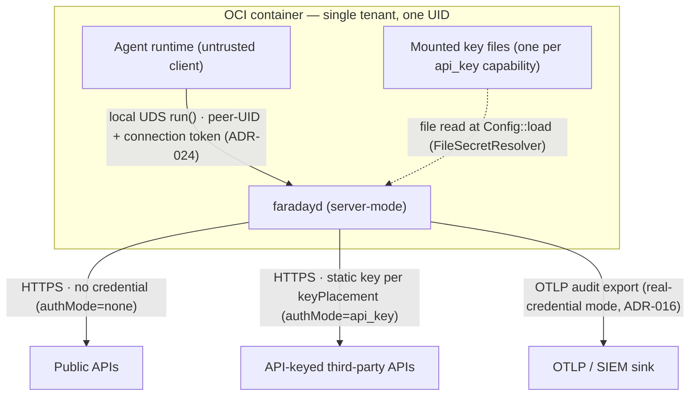

# Phase 2 — Architecture Artefacts (`faradayd-server-mode`)

> **Status:** Draft
> **derivedFromHld:** 0.3.0 (`docs/design/faradayd-server-mode/`)

A delta onto `docs/spec/sandbox-daemon/phase-2-architecture.md`. Only the components, shared types, and configuration that change for server-mode are restated here; everything else is inherited.

## Contents
- [2A System Context Diagram](#2a-system-context-diagram)
- [2B Component Inventory](#2b-component-inventory)
- [2C Shared Types Catalogue](#2c-shared-types-catalogue)
- [2D Configuration & Environment Variables](#2d-configuration--environment-variables)

## 2A System Context Diagram



Every arrow carries protocol + auth. The agent→daemon arrow is the inherited TB1 boundary (no network auth; same UID). No OIDC IdP and no `obo-broker` appear — the server-mode profile uses neither for `api_key`/`none` capabilities.

## 2B Component Inventory

All components are existing Rust modules in the one `faradayd` binary; this profile changes the modules marked **extends existing**. Build order is a DAG: C1 → C4 → C11 → C13, with C10 unchanged (Config and PolicyEngine feed the broker and controller, the baseline ordering). **C10 (DownstreamClient) carries no delta** — the two placements reuse seams it already exposes (the `apply` closure and `Params`→query serialisation, `downstream.rs:119-127`); it is listed for context only.

| # | Component | Module (`src/…`) | Type | Phase | Dependencies | Complexity |
|---|---|---|---|---|---|---|
| C1 | Config | `config` | extends existing | 3 | — | Low |
| C4 | PolicyEngine | `policy` | extends existing | 3 | SecretResolver (C1) | Medium |
| C11 | IdentityBroker | `broker` | extends existing | 3 | Config, PolicyEngine, DownstreamClient, AuditLogger | High |
| C13 | SandboxController | `controller` | extends existing | 3 | IdentityBroker, PolicyEngine, ConsentUI, SessionManager | High |
| C10 | DownstreamClient | `downstream` | inherited (no change) | — | Config | — |
| SCHEMA | Policy manifest schema | `docs/design/sandbox-daemon/schema/pysandbox.policy.schema.json` | extends existing | 3 | — | Low |

## 2C Shared Types Catalogue

Restated with the server-mode additions. Fields/variants marked **new** are the delta; all others are verbatim from `types.rs`.

**`AuthMode`** (`types.rs:24-35`, extended):

```rust
#[derive(Debug, Clone, Copy, PartialEq, Eq, Default, serde::Deserialize)]
#[serde(rename_all = "lowercase")]
pub enum AuthMode {
    #[default]
    Exchange,
    Passthrough,
    #[serde(rename = "api_key")]   // new — lowercase would yield "apikey"
    ApiKey,                        // new
    #[serde(rename = "none")]      // new — explicit; avoids relying on Option::None shadowing
    Unauthenticated,               // new
}
```
Used by: PolicyEngine (C4), IdentityBroker (C11).

**`KeyPlacement`** (new — resolves OQ-SM-2):

```rust
/// How an api_key capability's resolved key is attached to the outbound request — C4/C10/C11.
#[derive(Debug, Clone, PartialEq, Eq, serde::Deserialize)]
#[serde(rename_all = "lowercase")]
pub enum KeyPlacement {
    Header { name: String, #[serde(default)] scheme: Option<String> },
    Query { param: String },
}
```
Used by: PolicyEngine (C4), IdentityBroker (C11), DownstreamClient (C10).

**`ResolvedCapability`** (`types.rs:39-49`, extended — three **new** fields):

```rust
pub struct ResolvedCapability {
    pub id: String,
    pub provider: String,
    pub audience: Option<String>,
    pub scopes: Vec<String>,
    pub host: String,
    pub path_allow: Vec<regex::Regex>,
    pub methods: Vec<String>,
    pub require_step_up: bool,
    pub auth_mode: AuthMode,
    pub secret_ref: Option<String>,      // new — Some(_) iff auth_mode == ApiKey
    pub key_placement: Option<KeyPlacement>, // new — Some(_) iff auth_mode == ApiKey
    pub allow_write: bool,               // new — default false (ADR-039)
}
```
Used by: PolicyEngine (C4), IdentityBroker (C11), SandboxController (C13).

**`Credential`** (`types.rs:99-103`, **unchanged**): `api_key` header placement reuses `Credential::Headers` (or `Credential::Bearer` when `scheme == "Bearer"`), applied through C10's existing `apply` closure exactly as `Passthrough` applies its Bearer today (`broker.rs:293-311`); query placement does not use `Credential` (the key is appended to `Params` before `do_call`). `none` uses no `Credential` (a no-op `apply` closure). This refines the HLD's "DownstreamClient applies key per placement" wording (`02-architecture.md`) to its LLD-accurate seam — C10's contract is unchanged; the placement is built in C11.

**`ApiKeyStore`** (new — a startup-frozen key store, injected into C11):

```rust
/// Resolves an api_key capability's `secretRef` to its key string. Built once at daemon
/// startup from the manifest's distinct secretRefs via SecretResolver (AS-6); frozen
/// thereafter. Keys are never logged and never returned to the guest — C11.
pub trait ApiKeyStore: Send + Sync {
    /// The key for a resolver reference, with a single trailing newline trimmed
    /// (mounted secret files commonly carry one). None if the ref was not resolved at startup.
    fn lookup(&self, secret_ref: &str) -> Option<String>;
}
```
Used by: IdentityBroker (C11). Built by: daemon bootstrap from `PolicyEngine::api_key_secret_refs()` (C4) + the `SecretResolver` (C1).

## 2D Configuration & Environment Variables

Only the rows that change. All other `PYS_*` variables are inherited unchanged from `docs/spec/sandbox-daemon/phase-2-architecture.md` §2D.

| Variable | Type | Default | Required | Owner | Description |
|---|---|---|---|---|---|
| `PYS_OIDC_ISSUER` | string | — | **Conditional** | Config | OIDC issuer. **Server-mode change (ADR-038):** required only when the loaded manifest has a capability with `authMode` `exchange` or `passthrough`; not required for a pure `api_key`/`none` manifest. |
| `PYS_OIDC_CLIENT_ID` | string | — | **Conditional** | Config | OIDC public client id. Same conditional requiredness as `PYS_OIDC_ISSUER` (ADR-038). |
| `PYS_OTLP_ENDPOINT` | string | — | No\* | Config | OTLP/SIEM export endpoint. \*Required in real-credential mode (ADR-016); a real `api_key` deployment is real-credential and so requires it. Unchanged rule. |

**No new fixed environment variable.** A per-capability key is named by the manifest's `secretRef`, whose value is a `SecretResolver` reference (a file path under `FileSecretResolver`, `config.rs:15-24`) — not an env var. Mount the key file into the container and point `secretRef` at it.

**End of Phase 1–2.** Per the two-round workflow, stop here for confirmation of the Phase 1 assumptions (especially AS-2, AS-4, AS-5, AS-7) before authoring Phase 3–6.
