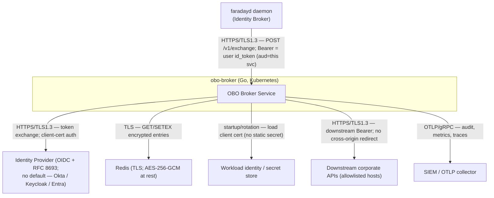

# Phase 2 — Architecture Artefacts (`obo-broker`)

## Table of contents
- [2A — System Context Diagram](#2a--system-context-diagram)
- [2B — Component Inventory](#2b--component-inventory)
- [2C — Shared Types Catalogue](#2c--shared-types-catalogue)
- [2D — Configuration & Environment Variables](#2d--configuration--environment-variables)

## 2A — System Context Diagram



## 2B — Component Inventory

Build order is the dependency DAG (leaves first). All components are `service` type (greenfield); no `as-built`.

| # | Component | Type | Phase | Dependencies | Complexity |
|---|---|---|---|---|---|
| C1 | Config | service | 3 | — | Low |
| C2 | ErrorEnvelope | service | 4 (cross-cutting) | — | Low |
| C3 | AuditLogger | service | 3 | Config, OTel | Low |
| C4 | TokenCacheAdapter | service | 3 | Config, Redis, KeyManager | Medium |
| C5 | PolicyEnforcer | service | 3 | Config | Medium |
| C6 | RFC8693Provider (Provider Plugin) | service | 3 | Config, TokenCacheAdapter, coreos/go-oidc, x/oauth2 | High |
| C7 | ProviderRegistry | service | 3 | RFC8693Provider, Config | Low |
| C8 | DownstreamClient | service | 3 | Config | Medium |
| C9 | ResponseSanitizer | service | 3 | Config | Low |
| C10 | ExchangeHandler | service | 3 | ProviderRegistry, PolicyEnforcer, TokenCacheAdapter, DownstreamClient, ResponseSanitizer, AuditLogger | High |
| C11 | HealthHandler | service | 4 (cross-cutting) | ProviderRegistry, TokenCacheAdapter | Low |
| C12 | AdminInvalidateHandler | service | 3 | TokenCacheAdapter, Config, AuditLogger | Low |
| C13 | KeyManager (active backend) | service | 3 | Config, KMS SDK | Medium |

DAG check: C1 has no deps; C3, C5, C8, C9, C13 depend only on C1 (+ external); C4 on C1/C13 (+ Redis); C6 depends on C4; C7 on C6; C10 on C5/C7/C4/C8/C9/C3; C11 on C7/C4; C12 on C4/C1/C3. No cycles (C13 is a leaf; C4 now depends on it).

## 2C — Shared Types Catalogue

Go definitions. Every type lists **Used by**.

```go
// ExchangeRequest — inbound body of POST /v1/exchange.
type ExchangeRequest struct {
    UserIDToken   string            `json:"userIdToken"`             // raw JWT; validated, never stored
    CapabilityID  string            `json:"capabilityId"`            // policy key, e.g. "internal.tickets"
    Verb          string            `json:"verb"`                    // GET|POST|PATCH|PUT|DELETE
    Path          string            `json:"path"`                    // downstream path; canonicalised before allowlist match
    Params        map[string]string `json:"params,omitempty"`
    Body          json.RawMessage   `json:"body,omitempty"`          // opaque; size-capped
    RunID         string            `json:"runId,omitempty"`         // correlation id from the daemon
}
// Used by: ExchangeHandler (C10).

// ExchangeResponse — outbound body; the downstream credential is NEVER included.
type ExchangeResponse struct {
    Status   int             `json:"status"`              // downstream HTTP status
    Body     json.RawMessage `json:"body"`                // sanitised downstream body (size-capped)
    Host     string          `json:"host"`
    Path     string          `json:"path"`
    Method   string          `json:"method"`
    CacheHit bool            `json:"cacheHit"`
    Truncated bool           `json:"truncated,omitempty"`
}
// Used by: ExchangeHandler (C10), ResponseSanitizer (C9).

// Principal — the validated user identity extracted from id_token.
type Principal struct {
    Subject  string   // "sub" claim — stable user id
    AgentID  string   // "azp" (authorized-party / client id) claim — the calling agent; server-derived, never caller-supplied
    Email    string   // optional; never logged in clear
    Issuer   string
    ACR      string    // "acr" claim — authentication context class; basis for step-up (AS-16); server-derived, never caller-supplied
    AMR      []string  // "amr" claim — authentication methods; corroborating evidence for step-up
    AuthTime time.Time // "auth_time" claim — when the user last authenticated; the step-up recency basis (AS-17, ADR-015); server-derived, never caller-supplied
}
// Used by: RFC8693Provider (C6), PolicyEnforcer (C5), TokenCacheAdapter (C4), AuditLogger (C3).

// ResolvedCapability — a policy entry after lookup.
type ResolvedCapability struct {
    ID               string
    Provider         string   // e.g. "rfc8693" (reference); provider-specific id for non-standard dialects
    Audience         string
    Scopes           []string
    Host             string   // single allowlisted host
    PathAllow        []*regexp.Regexp
    Methods          []string
    RequireStepUpAuth bool
}
// Used by: PolicyEnforcer (C5), ProviderRegistry (C7), RFC8693Provider (C6).

// Credential — what a plugin acquires; applied to the outbound request, never returned.
type Credential struct {
    Kind      string            // "bearer" | "headers" | "mtls"
    Token     string            // for "bearer"
    Headers   map[string]string // for "headers"
    ExpiresAt time.Time
}
// Used by: RFC8693Provider (C6), TokenCacheAdapter (C4), DownstreamClient (C8).

// CacheKey / cache entry — value is encrypted at rest by the adapter.
type CacheKey struct {
    UserSub    string
    Audience   string
    Scopes     string // canonical sorted join
    ProviderID string
}
// Used by: TokenCacheAdapter (C4), RFC8693Provider (C6).

// ProviderPlugin — the SPI (ADR-009). Compiled-in implementations only.
type ProviderPlugin interface {
    ID() string
    ValidateIdentity(ctx context.Context, idToken string) (Principal, error)
    AcquireDownstreamCredential(ctx context.Context, p Principal, cap ResolvedCapability) (Credential, error)
    ApplyCredential(req *http.Request, c Credential)
    Refresh(ctx context.Context, p Principal, cap ResolvedCapability) (Credential, error)
}
// Used by: ProviderRegistry (C7), ExchangeHandler (C10); implemented by RFC8693Provider (C6).

// KeyManager — the KMS SPI (ADR-018). Compiled-in implementations only; never dynamically loaded.
// The active backend is selected at startup by OBO_KMS_PROVIDER; no default.
type KeyManager interface {
    ID() string
    // GenerateDataKey mints a fresh per-entry data key under the configured master key
    // (OBO_CACHE_ENC_KEY_REF): plaintext is used to seal the credential; wrapped is persisted
    // alongside the ciphertext. The plaintext data key is never written to the cache.
    GenerateDataKey(ctx context.Context) (plaintext []byte, wrapped []byte, err error)
    // Unwrap recovers the plaintext data key from its wrapped form (a KMS decrypt) on read.
    Unwrap(ctx context.Context, wrapped []byte) (plaintext []byte, err error)
}
// Used by: TokenCacheAdapter (C4); implemented by the KeyManager backends (C13).

// ErrorEnvelope — the single error shape (AS-11).
type ErrorEnvelope struct {
    Error string `json:"error"`
    Code  string `json:"code"` // UPPER_SNAKE; see error registry in phase-4
}
// Used by: every component that returns an HTTP error.

// AdminInvalidateRequest — operator request to evict a user's cached downstream credentials (ADR-016).
type AdminInvalidateRequest struct {
    UserSub    string `json:"userSub"`              // required — Principal.Subject whose entries to evict
    Audience   string `json:"audience,omitempty"`   // optional filter — restrict to one downstream audience
    ProviderID string `json:"providerId,omitempty"` // optional filter — restrict to one provider, e.g. "rfc8693"
}
// Used by: AdminInvalidateHandler (C12), TokenCacheAdapter (C4).

// AdminInvalidateResponse — count of evicted entries.
type AdminInvalidateResponse struct {
    Evicted int `json:"evicted"`
}
// Used by: AdminInvalidateHandler (C12).

// AuditEntry — one record per exchange + downstream call.
type AuditEntry struct {
    Timestamp     time.Time
    RunID         string
    UserHMAC      string // HMAC of Principal.Subject, keyed per-install
    Provider      string
    CapabilityID  string
    Method        string
    Host          string
    Path          string
    StatusCode    int
    RequestBytes  int
    ResponseBytes int
    DurationMs    int64
    CacheHit      bool
}
// Used by: AuditLogger (C3), ExchangeHandler (C10).
```

## 2D — Configuration & Environment Variables

| Variable | Type | Default | Required | Owner | Description |
|---|---|---|---|---|---|
| `OBO_LISTEN_ADDR` | string | `:8080` | No | Config | HTTP listen address. |
| `OBO_IDP_ISSUER` | string | — | Yes | Config | IdP issuer URL — OIDC discovery + JWKS (Okta, Keycloak, Entra, or a generic RFC 8693 authorization server; ADR-017). |
| `OBO_IDP_AUDIENCE` | string | — | Yes | Config | Expected `aud` of inbound `id_token` (this service). |
| `OBO_IDP_CLIENT_ID` | string | — | Yes | Config | Confidential-client id for token exchange. |
| `OBO_IDP_CLIENT_CERT_REF` | string | — | Yes | Config | Reference to the client certificate (workload identity / secret store). |
| `OBO_REDIS_ADDR` | string | — | Yes | Config | Redis address. |
| `OBO_REDIS_TLS` | bool | `true` | No | Config | Enable TLS to Redis. |
| `OBO_KMS_PROVIDER` | string | — | Yes | Config | Selects the **KeyManager backend** (ADR-018): one of `awskms`, `gcpkms`, `azurekv`, `vault-transit`. No default — an unset or unknown value fails config closed at startup. Deployment-wide (one KMS per single-tenant instance). |
| `OBO_CACHE_ENC_KEY_REF` | string | — | Yes | Config | Reference to the **master key** the selected KeyManager backend uses for envelope encryption of cache entries (per-entry data keys; ADR-011/ADR-018). |
| `OBO_POLICY_PATH` | string | — | Yes | Config | Path to the derived capability policy file. |
| `OBO_MAX_CALLS_PER_SESSION` | int | `500` | No | Config | Per-`(user, agent)` call budget (`agent` = the token `azp` claim). |
| `OBO_STEP_UP_ACR_VALUES` | csv | (empty) | No\* | Config | Acceptable `id_token` `acr` values that satisfy a capability's `requireStepUpAuth` (AS-16). \*Required if any capability sets `requireStepUpAuth`; the manifest load fails closed otherwise. Org-specific — verify per deployment (example only: `urn:acme:loa:mfa`). |
| `OBO_STEP_UP_MAX_AGE_SECONDS` | int | `300` | No\* | Config | Maximum age of the validated `id_token`'s `auth_time` for a `requireStepUpAuth` capability — step-up means *recent* step-up, not a historical one (ADR-015 / AS-17). \*Required if any capability sets `requireStepUpAuth`; config load fails closed otherwise. |
| `OBO_CACHE_MAX_TTL_SECONDS` | int | `900` | No | Config | Hard ceiling on a cached downstream credential's TTL; the effective TTL is `min(credential expiry − refresh window, this)` (ADR-016 / AS-8). Bounds revocation lag for a token the service does not control. |
| `OBO_RESPONSE_MAX_BYTES` | int | `1048576` | No | Config | Downstream response size cap. |
| `OBO_REQUEST_MAX_BYTES` | int | `65536` | No | Config | Inbound request body cap. |
| `OBO_JWKS_CACHE_TTL` | duration | `5m` | No | Config | JWKS cache lifetime. |
| `OBO_REFRESH_WINDOW` | duration | `60s` | No | Config | Pre-expiry re-exchange window. |
| `OBO_DOWNSTREAM_TIMEOUT` | duration | `10s` | No | Config | Per-downstream-call timeout. |
| `OBO_CLOCK_SKEW` | duration | `60s` | No | Config | Allowed leeway on `exp`/`nbf`. |
| `OBO_OTLP_ENDPOINT` | string | — | No | Config | OTLP collector endpoint (audit/metrics/traces). |
| `OBO_LOG_LEVEL` | string | `info` | No | Config | `debug`/`info`/`warn`/`error`. |
| `OBO_ADMIN_ENABLED` | bool | `false` | No | Config | Enable the operator admin endpoint `POST /v1/admin/invalidate` (ADR-016 / AS-18). Off by default; the endpoint returns 404 when disabled. |
| `OBO_ADMIN_CLIENT_CA_REF` | string | — | No\* | Config | Reference to the CA bundle that signs operator client certificates for admin mTLS. \*Required when `OBO_ADMIN_ENABLED=true`; config fails closed otherwise. |
| `OBO_ADMIN_ALLOWED_CNS` | csv | (empty) | No\* | Config | Allowlist of client-certificate subject CNs permitted to call the admin endpoint. \*Required when `OBO_ADMIN_ENABLED=true`. |
