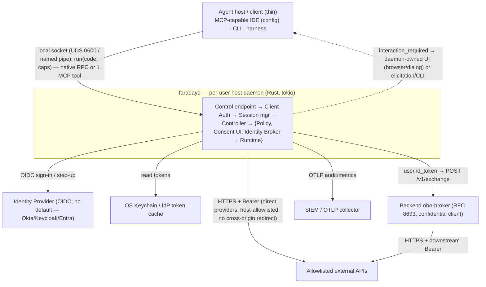

# Phase 2 — Architecture Artefacts (`sandbox-daemon`)

## Table of contents
- [2A — System Context Diagram](#2a--system-context-diagram)
- [2B — Component Inventory](#2b--component-inventory)
- [2C — Shared Types Catalogue](#2c--shared-types-catalogue)
- [2D — Configuration & Environment Variables](#2d--configuration--environment-variables)

## 2A — System Context Diagram



## 2B — Component Inventory

Build order is the dependency DAG (leaves first). All components are Rust modules in one binary (ADR-026); the Runtime may optionally be a child process (AS-2).

| # | Component | Crate/module (`crates/…` or `src/…`) | Phase | Dependencies | Complexity |
|---|---|---|---|---|---|
| C1 | Config | `config` | 3 | — | Low |
| C2 | Errors (typed errors + wire envelope) | `errors` | 4 (cross-cutting) | — | Low |
| C3 | AuditLogger | `audit` | 3 | Config, OTel | Medium |
| C4 | PolicyEngine | `policy` | 3 | Config | Medium |
| C5 | ResponseSanitizer | `sanitize` | 3 | Config | Low |
| C6 | ClientAuth | `clientauth` | 3 | Config | High |
| C7 | SessionManager | `session` | 3 | Config | Medium |
| C8 | ConsentUI / InteractionBroker | `interaction` | 3 | Config | High |
| C9 | OboClient (backend exchange) | `obo` | 3 | Config | Medium |
| C10 | DownstreamClient (direct providers) | `downstream` | 3 | Config | Medium |
| C11 | IdentityBroker (token vault, capability table, egress, OBO/direct, OIDC sign-in) | `broker` | 3 | Config, AuditLogger, PolicyEngine, ResponseSanitizer, OboClient, DownstreamClient, keychain | High |
| C12 | SandboxRuntime (Wasmtime + RustPython, single host import) | `runtime` | 3 | Config, IdentityBroker | High |
| C13 | SandboxController (run lifecycle, capability bundle, redaction, interaction routing) | `controller` | 3 | IdentityBroker, SandboxRuntime, PolicyEngine, ConsentUI, SessionManager, AuditLogger | High |
| C14 | ControlEndpoint (native-RPC listener; cross-platform UDS `0600` + peer-UID / named pipe + per-user-SID, ADR-030) | `endpoint` | 3 | ClientAuth, SessionManager, SandboxController | High |
| C15 | HealthCheck (liveness/readiness over the control socket) | `health` | 4 (cross-cutting) | IdentityBroker (dep reachability) | Low |
| C16 | McpFrontDoor (`faradayd mcp-stdio` sub-mode — MCP stdio server; untrusted client of C14, ADR-028) | `mcp` | 3 | (client of) ControlEndpoint over the control socket; the connection-token file | High |
| — | `pysandbox_sdk` (guest Python module — contract surface) | `sdk/` (Python) | 3 | the single WASM host import (C12) | Low |

DAG check: C1 has no deps; C2,C3,C4,C5,C6,C7,C8,C9,C10 depend only on C1 (+ external); C11 on C1/C3/C4/C5/C9/C10; C12 on C1/C11; C13 on C11/C12/C4/C8/C7/C3; C14 on C6/C7/C13; C15 on C11; **C16 is a separate process (the `mcp-stdio` sub-mode) that connects to C14 as an ordinary authenticated client — no in-process dependency, so it does not affect the build DAG**. No cycles (leaves → C11 → C12 → C13 → C14).

## 2C — Shared Types Catalogue

Rust definitions (serde-serialised over the control socket). Every type lists **Used by**.

```rust
// RunRequest — the single agent-facing entry payload (native RPC and the MCP tool share it).
pub struct RunRequest {
    pub code: String,                       // agent-authored Python
    pub requested_capabilities: Vec<String>,// capability ids, e.g. ["tickets"]
    pub timeout_ms: Option<u64>,
    pub dry_run: bool,                       // ADR-009: plan only, no execution
    pub workspace_id: String,               // session key component (with client identity)
    pub run_id: Option<String>,             // correlation id
}
// Used by: ControlEndpoint (C14), SandboxController (C13).

// RunResult — normal run; the downstream credential is NEVER included.
pub struct RunResult {
    pub stdout: String,                     // post-redaction
    pub stderr: String,                     // post-redaction
    pub exit_code: i32,
    pub api_calls: Vec<CallSummary>,        // {provider, host, path, method, status}
    pub truncated: bool,
}
// DryRunResult — planned calls only (static capability resolution, ADR-009).
pub struct DryRunResult { pub planned_calls: Vec<CallSummary> }
// CallSummary — names a call; carries no body and no token.
pub struct CallSummary { pub provider: String, pub host: String, pub path: String, pub method: String, pub status: Option<u16> }
// Used by: SandboxController (C13), ControlEndpoint (C14).

// Principal — the validated user identity from the OIDC id_token (held only in the daemon).
pub struct Principal { pub subject: String, pub issuer: String, pub acr: Option<String>, pub amr: Vec<String>, pub auth_time: Option<i64> }
// Used by: IdentityBroker (C11), OboClient (C9), AuditLogger (C3).

// ClientIdentity — the authenticated connecting peer (server-derived, never client-asserted).
// `principal` is the opaque, platform-neutral peer identity: decimal UID on Unix, string SID on Windows.
pub struct ClientIdentity { pub principal: String, pub client_label: String /* e.g. "vscode", "cli" */ }
// Used by: ClientAuth (C6), SessionManager (C7).

// Session — keyed by (client, workspace); holds consent cache + budgets in memory.
pub struct Session { pub client: ClientIdentity, pub workspace_id: String, pub consented: std::collections::HashSet<String>, pub calls_used: u32 }
// Used by: SessionManager (C7), SandboxController (C13).

// ResolvedCapability — a manifest entry after lookup.
pub struct ResolvedCapability {
    pub id: String, pub provider: String,   // e.g. "rfc8693" (OBO) | "github" (direct)
    pub audience: Option<String>, pub scopes: Vec<String>,
    pub host: String, pub path_allow: Vec<regex::Regex>, pub methods: Vec<String>,
    pub require_step_up: bool,
}
// Used by: PolicyEngine (C4), IdentityBroker (C11), SandboxController (C13).

// CapabilityHandle — opaque per-run handle bound to this daemon instance.
pub struct CapabilityHandle { pub cap_id: [u8; 16], pub capability_id: String, pub expires_at: i64 }
// Used by: SandboxController (C13), IdentityBroker (C11), SandboxRuntime (C12).

// Credential — what the broker holds/acquires; applied to outbound requests, never returned.
pub enum Credential { Bearer(String), Headers(std::collections::HashMap<String,String>) }
// Used by: IdentityBroker (C11), OboClient (C9), DownstreamClient (C10).

// UntrustedResponse — the typed envelope returned to the guest (ADR-017).
pub struct UntrustedResponse { pub untrusted: bool /* always true */, pub status: u16, pub content_type: String, pub body: Vec<u8>, pub truncated: bool }
// Used by: ResponseSanitizer (C5), SandboxRuntime (C12).

// InteractionRequired — daemon→client challenge (ADR-025); never client-asserted satisfied.
pub enum InteractionRequired {
    // `audiences`: the distinct resource audiences the run's capabilities require, so the
    // sign-in requests an access token audienced for each resource (ADR-033). Empty when no
    // capability sets `audience`.
    SignIn { issuer: String, audiences: Vec<String> },
    Consent { capability_id: String, host: String, methods: Vec<String>, provider: String, require_step_up: bool },
    StepUp { acr_values: Vec<String>, max_age_secs: u64, audiences: Vec<String> },
}
// Used by: ConsentUI (C8), SandboxController (C13), ControlEndpoint (C14).

// AuditEntry — one record per outbound call.
pub struct AuditEntry {
    pub timestamp: i64, pub run_id: String, pub user_hmac: String, pub client_label: String,
    pub provider: String, pub capability_id: String, pub method: String, pub host: String, pub path: String,
    pub status_code: u16, pub request_bytes: u64, pub response_bytes: u64, pub duration_ms: u64,
}
// Used by: AuditLogger (C3), IdentityBroker (C11), SandboxController (C13).

// WireError — the single error envelope on the control socket.
pub struct WireError { pub error: String, pub code: String /* UPPER_SNAKE; registry in phase-4 */ }
// Used by: every component that returns an error to a client.
```

## 2D — Configuration & Environment Variables

| Variable | Type | Default | Required | Owner | Description |
|---|---|---|---|---|---|
| `PYS_SOCKET_PATH` | string | `$XDG_RUNTIME_DIR/faradayd.sock` (UDS) / `\\.\pipe\faradayd-<uid>` (Windows) | No | Config | Control-socket path; created `0600` / per-user-SID ACL. |
| `PYS_CONNECTION_TOKEN_PATH` | string | `$XDG_RUNTIME_DIR/faradayd.token` | No | Config | `0600` file the daemon writes the per-launch connection token to (ADR-024). |
| `PYS_REQUIRE_FIRST_CONNECT_CONSENT` | bool | `true` | No | Config | Whether a new client identity must pass a first-connect consent (ADR-024 / OQ-A). |
| `PYS_OIDC_ISSUER` | string | — | Yes | Config | OIDC issuer for user sign-in (no default IdP — Okta/Keycloak/Entra/Dex); the daemon does generic discovery at `<issuer>/.well-known/openid-configuration` (ADR-029). |
| `PYS_OIDC_CLIENT_ID` | string | — | Yes | Config | OIDC **public client** id for the browser auth-code + PKCE sign-in (ADR-029). No client secret on the workstation. |
| `PYS_OIDC_SCOPES` | string | `openid profile email` | No | Config | Space-separated scopes requested at sign-in. |
| `PYS_OBO_ENDPOINT` | string | — | Yes\* | Config | Backend `obo-broker` base URL for token-exchange capabilities. \*Required if any capability uses a token-exchange provider. |
| `PYS_POLICY_PATH` | string | — | Yes | Config | Path to the shipped default `pysandbox.policy.json`. |
| `PYS_ADMIN_SIGNING_KEY_REF` | string | — | No | Config | Reference to the enterprise-admin public key that validates workspace policy overrides (ADR-021). Unset ⇒ overrides ignored. |
| `PYS_CONSENT_UI_MODE` | string | `auto` | No | Config | `browser` (local 127.0.0.1 page) / `dialog` (native) / `auto` (ADR-025 / OQ-C). |
| `PYS_MAX_CALLS_PER_RUN` | int | `50` | No | Config | Per-run outbound call budget; over-budget → `429`-shaped. |
| `PYS_MAX_CALLS_PER_SESSION` | int | `500` | No | Config | Per-`(client,workspace)` session budget. |
| `PYS_RESPONSE_MAX_BYTES` | int | `1048576` | No | Config | Downstream response size cap (truncation flag set above it). |
| `PYS_WASM_FUEL` | int | (tuned) | No | Config | Wasmtime fuel bound (CPU) per run (ADR-019). |
| `PYS_WASM_MAX_MEMORY_BYTES` | int | `536870912` | No | Config | Max guest linear memory (512 MiB). |
| `PYS_WASM_DEADLINE_SECONDS` | int | `30` | No | Config | Epoch-based wall-clock deadline per run. |
| `PYS_GUEST_ARTIFACT_DIGEST` | string | (pinned) | Yes | Config | Expected content digest of the bundled RustPython WASM guest; verified before instantiation, fail-closed (ADR-018). |
| `PYS_OTLP_ENDPOINT` | string | — | No\* | Config | OTLP/SIEM export endpoint. \*Required in real-credential mode (ADR-016); absent ⇒ mock / non-sensitive-credentials-only. |
| `PYS_AUDIT_HMAC_KEY_REF` | string | — | Yes | Config | Reference to the per-install HMAC key for the audited user identifier. |
| `PYS_LOG_LEVEL` | string | `info` | No | Config | `debug`/`info`/`warn`/`error`; `debug` never default in production. |
