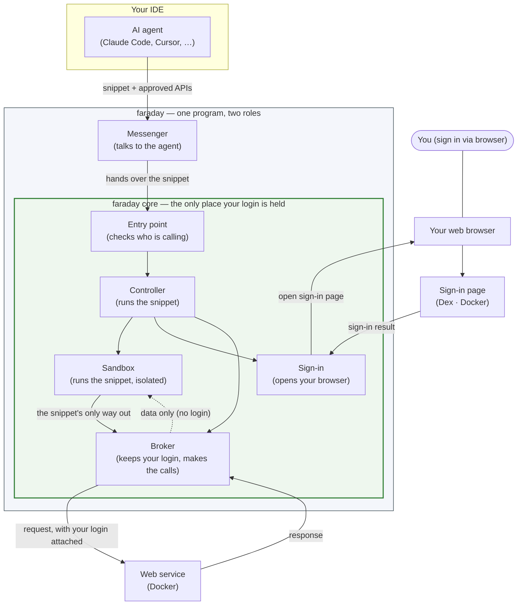

# Run the faraday demo on macOS

This sets up the demo on your Mac. You make a request through an AI agent in your IDE — for
example Claude Code or Cursor — that can connect to outside tools. (That connection uses a
standard called MCP; you don't need to know its details to follow this guide.) A short Python
snippet then runs inside an isolated sandbox, fetches data from a stand-in web service, and
returns it. Throughout, your login stays inside faraday — it is never passed to the snippet
or to the agent.

You run three things:

- **faraday** — runs the snippet, makes the web calls on your behalf, and holds your login.
- **Dex** — a stand-in for a company sign-in page, with one test account
  (`test@example.com` / `password`).
- **A stand-in web service** — returns fixed data when asked for `/json`.

The program is not code-signed yet, so macOS warns you the first time you run it. That is
expected for local testing.

## How the pieces fit together



faraday is one program in two roles. The outer part is a messenger that the agent talks to.
The inner part (green) does the work and is the only place your login is held. The agent
sends a snippet and receives data; it never sees your login, and neither does the snippet.

## Step 1 — Build the program

```
cargo build --release          # creates target/release/faradayd
```

## Step 2 — Start Dex and the web service

Docker runs both in the background.

```
docker compose -f examples/demo/docker-compose.yml up -d
# Sign-in page:   http://127.0.0.1:5556/dex   (log in with test@example.com / password)
# Web service:    http://127.0.0.1:8080       (ask for /json to get sample data)
```

## Step 3 — Prepare two settings

faraday keeps a private record of each call it makes. The first command creates the key that
protects that record (one-time). The second loads faraday's settings — where to find Dex,
where the web service is, and so on.

```
head -c 32 /dev/urandom > examples/demo/audit.key     # one-time: the log-protection key
set -a; . examples/demo/.env.sample; set +a            # load faraday's settings
```

## Step 4 — Start faraday

It runs in the background, waiting for requests, and listens only on a private channel on
your machine.

```
./target/release/faradayd
```

In a packaged install this starts automatically at login (see `packaging/macos/`); here you
start it by hand so you can see it run.

## Step 5 — Register faraday with your agent

The agent connects to faraday by configuration — there is no plugin to install.

For Claude Code, this writes the entry for you and leaves your other settings unchanged:

```
./target/release/faradayd install-mcp-config
```

For any other MCP-capable agent, add this to that agent's MCP-servers config, using the full
path to the binary:

```json
{
  "mcpServers": {
    "faradayd": { "command": "/full/path/to/faradayd", "args": ["mcp-stdio"] }
  }
}
```

Restart the agent so it picks up the new tool (`python_sandbox`).

## Step 6 — Use it from your agent

Give the agent an instruction like the one below (paste it into the agent's prompt or its
custom-instructions). It tells the agent what the tool is and how to call an approved API:

```
You have a tool called `python_sandbox` that runs Python in a sandbox. To call an
approved API, write Python using `api.<name>.get|post|patch|delete(path)` and list the
capability names you use in `requestedCapabilities`. The call returns the response bytes;
decode them with `.decode()`.

For this demo, fetch the sample data:
  tool:                  python_sandbox
  requestedCapabilities: ["dummy"]
  code:                  print(api.dummy.get('/json').decode())
```

What happens:

1. The agent calls `python_sandbox` with that code and capability.
2. The first time, faraday opens your browser to Dex. Log in as `test@example.com` /
   `password`.
3. Your login returns to faraday and stays there — it is not passed to the snippet or to the
   agent.
4. faraday runs the snippet, makes the call to the web service for it, and returns the data.
5. The agent shows the sample data, with no login or secret in it.

Current limitation: the Python available inside the sandbox covers dates, base64, lists, and
counters, plus the `api.…` calls — but `json` and regular expressions (`re`) are not
available yet (a tracked gap). Print the raw result with `.decode()` as above rather than
using `import json`.

## What this shows

- You write a small program instead of calling a fixed set of pre-built actions.
- Your login never leaves faraday; only the snippet and the returned data pass between the
  agent and faraday.
- You sign in yourself, in your own browser. The agent cannot do it for you.

## When you're done

```
docker compose -f examples/demo/docker-compose.yml down
```

To stop faraday, press Ctrl-C in its terminal.
