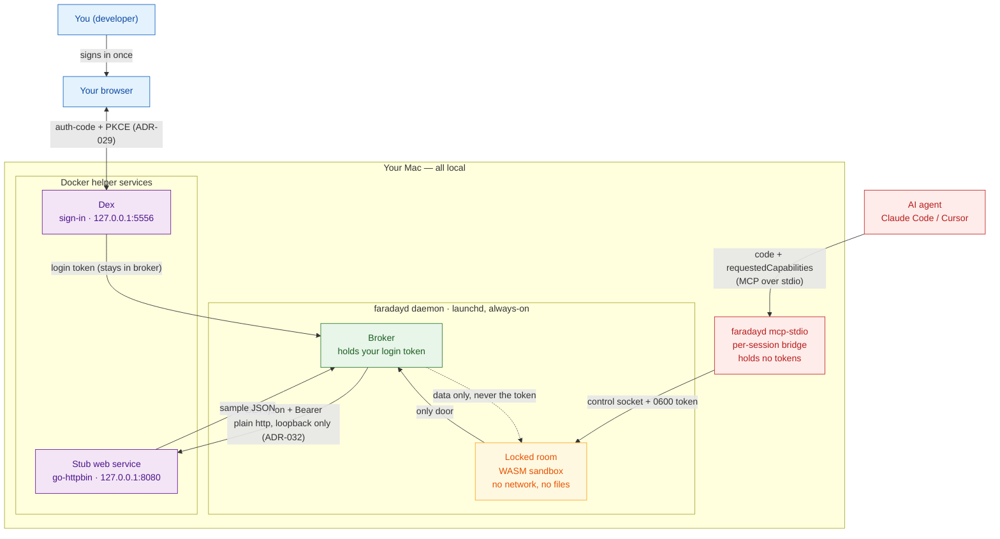

# Get started with the faraday sandbox

This guide takes you from nothing to a working setup, then shows you how to test it
from your AI agent. It is written for macOS.

## What this is, in one minute

faraday runs a small Python snippet inside a locked-down sandbox. The snippet can call a
few approved web APIs, but it can never see your login — faraday holds your login and
makes the calls for you, then hands back only the data.

Your AI agent (Claude Code, Cursor, or similar) talks to faraday through a standard called
**MCP**. You do not need to understand MCP — it is just the channel the agent uses to send
the snippet and receive the result. After setup, the agent gains a new tool called
`python_sandbox`.

The local demo wires in two helper services so you can test end to end on your own machine:

- **Dex** — a stand-in company sign-in page, with one test account.
- **A stub web service** (go-httpbin) — returns fixed sample data when asked.

## How the pieces fit together

Everything in the demo runs locally on your Mac. The agent never holds your login; the
daemon's broker does, and it is the only thing that talks to the web service.



Colours match the main README: blue is you, red is the untrusted agent side (which holds no
tokens), amber is the locked room, green is where your login lives, and purple is the local
helper services standing in for company systems.

## Before you start

You need:

- A **Mac** (the installer uses macOS launchd; it is macOS-only for now).
- **Docker** installed and running (Docker Desktop is fine). The two helper services run
  in Docker.
- The **Rust toolchain** (`cargo`). The repository pins the version for you via
  `rust-toolchain.toml`; if you do not have `cargo`, install it from <https://rustup.rs>.
- An **MCP-capable agent** — for example Claude Code or Cursor.

## Step 1 — Open a terminal in the right folder

All commands below run from the `sandbox-daemon` folder inside the repository.

```
cd sandbox-daemon
```

## Step 2 — Install

```
make install
```

This one command does everything:

1. Builds the faraday program (`cargo build --release`). The first build takes a few
   minutes; later builds are fast.
2. Copies the program to `~/.local/bin/faradayd` — a folder inside your home directory, so
   **no password is needed**.
3. Sets faraday to **start automatically** and stay running (a per-user launchd agent).
4. **Registers faraday with Claude Code** by adding an entry to `~/.claude.json` —
   without touching any of your other settings.
5. **Starts the two helper services** (Dex and the stub web service) in Docker.

When it finishes you will see a line confirming the service is installed and where the
logs are.

> **About the install location.** `~/.local/bin` may not be on your shell `PATH`, so typing
> `faradayd` directly might not find it. That does not matter here: the background service and
> your agent both call it by its full path.

> **Demo-only setting.** The installed service sets `PYS_ALLOW_PLAINTEXT_LOOPBACK_EGRESS=true`
> so it can reach the stub web service over plain `http` on `127.0.0.1` — never a remote host
> (ADR-032). Production leaves this off and is HTTPS-only. See
> [Local configuration and why](#local-configuration-and-why) for the full set of settings and
> their rationale.

## Step 3 — Check it is running

```
launchctl list | grep faraday
```

You should see a line like:

```
8805    0   dev.faraday.faradayd
```

The first number is the running process ID. The middle `0` means it started cleanly. If
you ever want to read its output:

```
tail ~/Library/Logs/faradayd.out.log     # normal startup line: "faradayd listening"
tail ~/Library/Logs/faradayd.err.log     # errors, if any
```

## Step 4 — Connect your agent

**Claude Code** — `make install` already added the entry for you. Just **restart Claude
Code** so it picks up the new `python_sandbox` tool.

**Any other MCP-capable agent** — add this to that agent's MCP-servers configuration,
then restart the agent. Use the **absolute** path to the binary — JSON cannot contain `~`,
so write out `~/.local/bin/faradayd` in full (for example `/Users/you/.local/bin/faradayd`):

```json
{
  "mcpServers": {
    "faradayd": { "command": "/Users/you/.local/bin/faradayd", "args": ["mcp-stdio"] }
  }
}
```

## Step 5 — Test it

In your agent, give it an instruction like this (paste it into the prompt):

```
You have a tool called `python_sandbox` that runs Python in a sandbox. To call an
approved API, write Python using `api.<name>.get(path)` and list the capability names
you use in `requestedCapabilities`. The call returns the response bytes; decode them
with `.decode()`.

Fetch the sample data:
  tool:                  python_sandbox
  requestedCapabilities: ["dummy"]
  code:                  print(api.dummy.get('/json').decode())
```

What happens:

1. The agent calls `python_sandbox` with that code.
2. **The first time**, faraday opens your browser to the sign-in page. Log in as:
   - **Email:** `test@example.com`
   - **Password:** `password`
3. Your login goes back to faraday and **stays there** — it is never passed to the
   snippet or the agent.
4. faraday runs the snippet, makes the web call for it, and returns the sample data.
5. The agent shows the data, with no login or secret in it.

If you see the sample data come back, everything is working.

> **Note on the sandbox's Python:** it covers dates, base64, lists, and counters, plus the
> `api.…` calls — but `json` and regular expressions (`re`) are not available yet. Print
> the raw result with `.decode()` as shown above rather than using `import json`.

## Step 6 — Call a real public API (no sign-in)

Step 5 called the local stub and made you sign in first. This one is different: it calls a
**real API on the internet** that needs no login at all. There is no token to hold, so faraday
just makes the call and hands back the data — no browser pop-up.

The demo policy ships one such capability, `catfacts`, pointing at the free, no-auth
[Cat Facts API](https://catfact.ninja). It is set to `authMode: none`, which is what tells
faraday "this one has no login".

Give your agent this:

```
Run this in the sandbox:
  tool:                  python_sandbox
  requestedCapabilities: ["catfacts"]
  code:                  print(api.catfacts.get('/fact').decode())
```

You should get back a random cat fact, something like:

```
{"fact":"Cats sleep 70% of their lives.","length":31}
```

What is different from Step 5:

- **No sign-in.** The capability is unauthenticated (`authMode: none`), so faraday does not
  open the browser — there is no login to collect.
- **A real host over HTTPS.** The call goes to `catfact.ninja` on the public internet, not the
  local stub. Remote hosts are always called over HTTPS; the plaintext setting only ever
  applies to `127.0.0.1`.

> **This step needs internet access.** Unlike the rest of the demo, which runs entirely on
> your machine, this call reaches a real host on the public internet. If you are offline it
> will fail with `DOWNSTREAM_UNAVAILABLE`; the local Step 5 still works without a network.

> **Try another one.** Any free, no-auth API works the same way: add a capability for it to
> `examples/demo/pysandbox.policy.json` (copy the `catfacts` block, change `host` and
> `pathAllow`) and restart the service so it reloads the policy. The
> [list of free, no-auth APIs at mixedanalytics](https://mixedanalytics.com/blog/list-actually-free-open-no-auth-needed-apis/)
> is a good source of ideas. Pick an `https://` one, and remember the sandbox has no `json`
> module — print the raw bytes with `.decode()`.

## Step 7 — Prove the sandbox runs real Python

The first test fetched data; this one shows the sandbox is a **real Python runtime** —
functions, comprehensions, exceptions, and a slice of the standard library — all inside the
locked-down guest with no network and no files. It calls no APIs, so the capability list is
empty — and with no authenticated capability in the run, faraday needs no sign-in, just like
Step 6.

Give your agent this instruction:

```
Run this in the sandbox with no capabilities:
  tool:                  python_sandbox
  requestedCapabilities: []
  code: |
    import datetime, base64, collections, itertools

    def fib(n):
        a, b = 0, 1
        seq = []
        for _ in range(n):
            seq.append(a)
            a, b = b, a + b
        return seq

    squares = [x * x for x in range(1, 6)]
    evens = list(filter(lambda n: n % 2 == 0, range(10)))

    words = "the quick brown fox the lazy dog the".split()
    freq = collections.Counter(words)
    unique = sorted(set(words))

    day = datetime.date(2026, 6, 16)
    token = base64.b64encode(b"faraday sandbox").decode()
    steps = list(itertools.islice(itertools.count(10, 5), 3))

    print(f"fib(10)      = {fib(10)}")
    print(f"squares      = {squares}")
    print(f"evens        = {evens}")
    print(f"word counts  = {dict(freq)}")
    print(f"unique words = {unique}")
    print(f"date         = {day.isoformat()}")
    print(f"base64       = {token}")
    print(f"itertools    = {steps}")
    try:
        1 / 0
    except ZeroDivisionError as e:
        print(f"caught       = {type(e).__name__}")
```

You should get exactly:

```
fib(10)      = [0, 1, 1, 2, 3, 5, 8, 13, 21, 34]
squares      = [1, 4, 9, 16, 25]
evens        = [0, 2, 4, 6, 8]
word counts  = {'the': 3, 'quick': 1, 'brown': 1, 'fox': 1, 'lazy': 1, 'dog': 1}
unique words = ['brown', 'dog', 'fox', 'lazy', 'quick', 'the']
date         = 2026-06-16
base64       = ZmFyYWRheSBzYW5kYm94
itertools    = [10, 15, 20]
caught       = ZeroDivisionError
```

This exercises functions, loops, list/dict/set comprehensions, lambdas, f-strings, exception
handling, and the `datetime`, `base64`, `collections`, and `itertools` modules — the standard
library the sandbox guarantees today (`json` and `re` are the tracked exceptions noted above).

## Step 8 — When you are done

To stop and remove everything — the service, the installed program, and the two Docker
helper services:

```
make uninstall
```

This removes everything with no password prompt. It leaves the Claude Code entry in
`~/.claude.json` untouched; if you want that gone too, remove the `faradayd` block from that
file by hand.

## Local configuration and why

Everything the demo needs is checked in under `examples/demo/`, and `make install` wires it
into the launchd service for you. You do not need to edit any of it to follow this guide —
this section is here so you understand what was set up and why, and what to change for a
real deployment.

### The files in `examples/demo/`

| File | What it is | Why it looks like this |
|---|---|---|
| `docker-compose.yml` | Brings up **Dex** (`127.0.0.1:5556`) and **go-httpbin** (`127.0.0.1:8080`). | Two throwaway local stand-ins — a real sign-in page and a "company API" — so the whole chain runs on one machine with no external accounts. |
| `dex-config.yaml` | A **public (PKCE) OAuth client** `faradayd`, one static user, and **no `redirectURIs`**. | Public client = no secret on the workstation (ADR-029). The empty `redirectURIs` is deliberate: it enables Dex's RFC 8252 any-port loopback exemption, so the daemon's ephemeral `127.0.0.1:<port>` redirect is accepted. |
| `pysandbox.policy.json` | The capability allowlist. Defines the `dummy` capability used in Step 5 and the `catfacts` no-auth capability used in Step 6. | The allowlist *is* the security boundary — the sandbox can only reach what is listed here. |
| `audit.key` | A 32-byte random key, created `0600` on first install. | The HMAC key for the tamper-evident audit log. Generated locally; never a shared secret. |

### The `dummy` capability

```json
{ "dummy": {
    "provider": "dummy",
    "authMode": "passthrough",
    "host": "127.0.0.1:8080",
    "pathAllow": ["^/json$", "^/anything(/.*)?$", "^/get$"],
    "methods": ["GET", "POST"]
} }
```

- **`host`** — where the broker sends the call. Points at the local go-httpbin.
- **`pathAllow`** — only these paths are reachable, matched as anchored regexes. `GET /json`
  (Step 5) matches `^/json$`; anything else is refused before any call is made.
- **`authMode: passthrough`** — the broker forwards *your* OIDC access token to the service
  as a `Bearer` header. (The other mode, `exchange`, swaps it for a downstream token via the
  OBO broker.) Because passthrough puts a real token on the wire, plaintext egress is
  permitted **only** to `127.0.0.1` — see the egress note below.

### The `catfacts` capability

```json
{ "catfacts": {
    "authMode": "none",
    "host": "catfact.ninja",
    "pathAllow": ["^/fact$"],
    "methods": ["GET"]
} }
```

This is the no-auth capability used in Step 6.

- **`authMode: none`** — the call carries no login at all, so there is no `provider`, no token,
  and no sign-in. faraday just fetches the data over HTTPS and returns it.
- **`host`** — a real public host (`catfact.ninja`). Because it is not `127.0.0.1`, the call is
  always made over HTTPS; the plaintext setting can never apply to it.
- **`pathAllow` / `methods`** — only `GET /fact` is reachable. Anything else is refused before
  any call is made, exactly as with `dummy`.

### The environment `make install` sets on the service

These are written into the launchd plist (`~/Library/LaunchAgents/dev.faraday.faradayd.plist`):

| Variable | Demo value | Rationale |
|---|---|---|
| `PYS_OIDC_ISSUER` | `http://127.0.0.1:5556/dex` | The local Dex. Plain `http` is allowed here only because it is loopback (ADR-029); a remote issuer must be `https`. |
| `PYS_OIDC_CLIENT_ID` | `faradayd` | Matches the public client in `dex-config.yaml`. |
| `PYS_OIDC_SCOPES` | `openid profile email` | Standard OIDC sign-in scopes. |
| `PYS_POLICY_PATH` | `examples/demo/pysandbox.policy.json` | The capability allowlist above. |
| `PYS_GUEST_ARTIFACT_DIGEST` | (from `CHECKSUMS.txt`) | Pins the exact WASM guest the daemon will load; a mismatch fails closed (ADR-018). |
| `PYS_AUDIT_HMAC_KEY_REF` | `examples/demo/audit.key` | Points at the audit key above. |
| `PYS_ALLOW_PLAINTEXT_LOOPBACK_EGRESS` | `true` | **Demo-only.** Lets the broker reach the stub service over plain `http` — see below. |

### Why plaintext egress is on for the demo (and safe here)

The stub service speaks plain `http` on `127.0.0.1:8080`, but production egress is
**HTTPS-only**. `PYS_ALLOW_PLAINTEXT_LOOPBACK_EGRESS=true` relaxes that — but only for the
literal loopback address `127.0.0.1`. A remote host (or even `localhost`, or a name like
`127.0.0.1.evil.com`) is **never** downgraded to `http`; it always stays HTTPS. This is
the same loopback-only exception already granted to the sign-in issuer, recorded as
**ADR-032**. The bound matters because passthrough forwards your token: on loopback it never
leaves the machine. **Leave this off in production, and never enable it on a host whose
loopback interface is shared with other users.**

To turn it off, drop the `PYS_ALLOW_PLAINTEXT_LOOPBACK_EGRESS` line from the plist (or set it
to `false`) and point the `dummy` capability's `host` at an `https` service.

## If something goes wrong

- **A `python_sandbox` call returns an empty result.** Look at the call's **`stderr`**: a
  failed brokered call now reports a code there (for example `DOWNSTREAM_UNAVAILABLE` if the
  web service is unreachable, or `IDP_UNAVAILABLE` if sign-in did not complete) instead of
  silently coming back blank. `DOWNSTREAM_UNAVAILABLE` on the `dummy` call usually means the
  stub service is down or plaintext egress is off — check the two settings above.
- **The agent does not see `python_sandbox`.** Restart the agent after `make install` so
  it re-reads its MCP configuration.
- **`launchctl list | grep faraday` shows no line, or the middle number is not `0`.** The
  service crashed. Read `~/Library/Logs/faradayd.err.log` for the reason.
- **A `config error` in the log.** The helper services may be down. Start them again:
  ```
  docker compose -f examples/demo/docker-compose.yml up -d
  ```
- **The sign-in page does not load.** Check Docker is running and the services are up:
  ```
  docker compose -f examples/demo/docker-compose.yml ps
  ```
- **A port is already in use (5556 or 8080).** Something else is using the demo's ports.
  Stop that program, or stop the demo services with the `down` command and try again.
